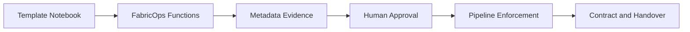

# Function Usage Guide

Use this page when you want to run **real Fabric notebook workflows** with FabricOps Starter Kit.

Start here for practitioner guidance. Use the [Callable Function Reference](index.md) only when you need detailed parameters, return values, or debugging detail.

## Start from templates, not individual functions

FabricOps functions are designed to be used through template notebooks in a governed workflow.

<table class="reference-template-table">
  <thead>
    <tr>
      <th>Notebook template</th>
      <th>Use this when...</th>
      <th>Guided structure</th>
    </tr>
  </thead>
  <tbody>
    <tr>
      <td data-label="Notebook template"><code>00_env_config</code></td>
      <td data-label="Use this when...">You need to bootstrap environment settings, runtime config, and shared setup used by other notebooks.</td>
      <td data-label="Guided structure"><a href="../notebook-structure/00-env-config/">00_env_config guide</a></td>
    </tr>
    <tr>
      <td data-label="Notebook template"><code>01_data_sharing_agreement</code></td>
      <td data-label="Use this when...">You need agreement context, governance boundaries, and reusable approved metadata for downstream work.</td>
      <td data-label="Guided structure"><a href="../notebook-structure/01-data-sharing-agreement/">01_data_sharing_agreement guide</a></td>
    </tr>
    <tr>
      <td data-label="Notebook template"><code>02_ex_*</code></td>
      <td data-label="Use this when...">You need exploration, profiling, and AI-assisted discovery that generates evidence for review.</td>
      <td data-label="Guided structure"><a href="../notebook-structure/02-exploration/">02_ex exploration guide</a></td>
    </tr>
    <tr>
      <td data-label="Notebook template"><code>03_pc_*</code></td>
      <td data-label="Use this when...">You need pipeline contract execution, approval-aware enforcement, run summary, and handover outputs.</td>
      <td data-label="Guided structure"><a href="../notebook-structure/03-pipeline-contract/">03_pc pipeline contract guide</a></td>
    </tr>
  </tbody>
</table>

Need notebook-to-function alignment? Use the [Template Function Map](template-function-map.md).

## Workflow story: from evidence to governed handover

The intended operating model is:

1. Generate evidence from profiling and metadata capture.
2. Review and approve governance and quality decisions.
3. Enforce only approved controls in pipeline execution.
4. Publish run summary and handover-ready artifacts.

## Function layers in practice

### 1) Setup and config functions
Use these at notebook start so all later steps run with consistent runtime context.

Typical examples: config loading, notebook setup helpers, environment/runtime checks.

### 2) Profiling and metadata capture
Use these to profile data and write structured evidence to metadata stores for review workflows.

Typical examples: dataframe profiling, metadata table read/write helpers, lineage record builders.

### 3) AI-assisted suggestions
Use these to draft candidate business context, governance labels, or DQ rules.

Important: AI outputs are advisory drafts and must be reviewed before enforcement.

### 4) Human approval functions and widgets
Use these to review, accept, reject, or deactivate suggested rules and governance context.

This is where operational control and accountability are applied.

### 5) Data quality enforcement
Use these in pipeline notebooks to enforce approved quality rules and block invalid output.

### 6) Drift and schema checks
Use these to compare current execution behavior against expected contract and historical baselines.

### 7) Run summary and evidence handover
Use these to produce auditable run summaries and handover-friendly markdown outputs.

For exact signatures and behavior by callable, inspect the [Callable Function Reference](index.md).

## Which function should I use?

### I want to set up a notebook
Start with template flow from `00_env_config`, then use setup/config callables (for example setup and config loaders) surfaced in the template and [Template Function Map](template-function-map.md).

### I want to profile a table
Use exploration flow from `02_ex_*`, then run profiling + metadata capture callables before any governance approvals.

### I want AI-suggested DQ rules
Use AI-assisted DQ drafting callables in `02_ex_*`, then pass results to review functions (do not enforce directly).

### I want to approve/reject rules
Use review widgets and approval callables (typically in agreement/exploration governance flow) so only approved records become active.

### I want to enforce rules in a pipeline
Use `03_pc_*` pipeline contract flow with DQ enforcement and drift checks using approved metadata inputs.

### I want to produce a handover summary
Use handover/run summary callables in `03_pc_*` to generate evidence-backed markdown and governance-ready outputs.

## Practical guidance

- Functions are **not** intended to be run randomly in isolation.
- Templates are the recommended entry point for reliable notebook operations.
- Use this page for workflow guidance and decision points.
- Use the [Callable Function Reference](index.md) for low-level API details.
- Use [Developer Reference](../developer-reference/) for internal implementation mechanics.

If you are new to the project, begin with **Start Here** and then return to this page as your practitioner playbook.
