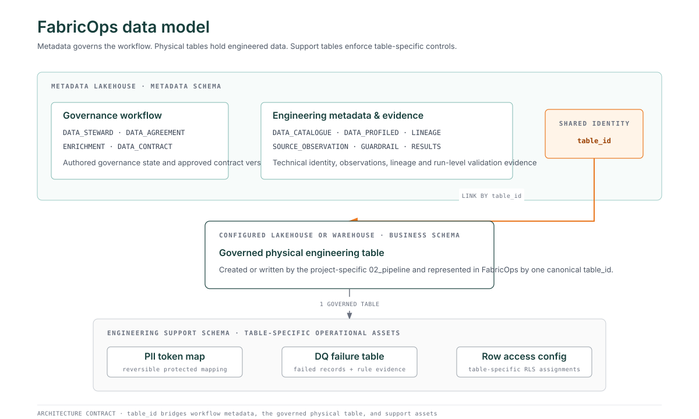

# FabricOps data model

FabricOps separates **workflow metadata**, **governed physical data**, and **table-specific engineering support** so each kind of state has one clear home.



`table_id` is the shared identity that connects the FabricOps Governance and Engineering workflow to the physical table produced by `02_pipeline`.

## 1. FabricOps workflow metadata

**FabricOps metadata describes how a governed table moves through the Governance and Engineering loop.**

These tables live in the configured **Metadata Lakehouse** under its metadata schema. They record governance state, technical identity, profiling, lineage, observations, Guardrail definitions and results, Data Agreements, and Data Contracts.

```text
Governance                         Engineering metadata
──────────                         ────────────────────
METADATA_DATA_STEWARD              METADATA_DATA_CATALOGUE
METADATA_DATA_AGREEMENT            METADATA_DATA_PROFILED
METADATA_ENRICHMENT                METADATA_DATA_PROFILED_FREQUENCY
METADATA_DATA_CONTRACT             METADATA_DATA_LINEAGE
                                   METADATA_SOURCE_OBSERVATION
                                   METADATA_GUARDRAIL
                                   METADATA_GUARDRAIL_RESULTS
                                   METADATA_DATA_ACCESS
```

The metadata model is centred on `METADATA_DATA_CATALOGUE`. Its canonical `table_id` identifies the governed logical table and is reused across the workflow.

!!! note "Current implementation audit"

    Two current metadata tables do not yet match the intended storage boundary and will be corrected in focused implementation PRs:

    * `METADATA_GUARDRAIL_ROW_RESULTS` currently stores row-level DQ failure evidence in the Metadata Lakehouse. Failed records should instead live with the governed physical dataset in a table-specific DQ failure table.
    * `METADATA_DATA_ACCESS` currently models row-level access assignments. Its intended metadata role is to record who has platform or SQL access to the physical table; row-level access configuration belongs with the physical dataset.

## 2. Governed physical engineering table

**The actual project data belongs in the configured Lakehouse or Warehouse, not in the Metadata Lakehouse.**

`02_pipeline` reads, transforms, and writes project-specific data into the configured physical target. That target keeps its project-specific table name and schema while FabricOps represents it with one canonical `table_id`.

```text
FabricOps metadata
       │
       │ table_id
       ▼
Configured Lakehouse / Warehouse
       │
       └── business_schema.<physical_table>
```

The same `table_id` lets Governance, Engineering Development, Engineering Production, and downstream consumers refer to the same governed asset without moving business data into the metadata schema.

## 3. Table-specific engineering support

**Operational controls that act on rows belong beside the governed physical table in an engineering support schema.**

For each governed `table_id`, FabricOps can maintain a one-to-one support set where the capability is required:

| Support asset | Purpose | Relationship |
| --- | --- | --- |
| **PII token map** | Holds reversible mappings when Direct PII is tokenised. | One table-specific token map for one governed `table_id`. |
| **DQ failure table** | Holds failed records and rule evidence required for investigation or remediation. | One table-specific failure table for one governed `table_id`. |
| **Row access configuration** | Holds row-level assignments used to enforce RLS for that dataset. | One table-specific RLS configuration for one governed `table_id`. |

These are **operational engineering assets**, not FabricOps workflow metadata. They may retain identifiers such as `table_id`, `guardrail_result_id`, and runtime audit fields for traceability.

## Access has two different meanings

FabricOps keeps physical access and row-level access separate:

| Concern | Intended home |
| --- | --- |
| Who has Fabric or SQL permission to access the physical table | `METADATA_DATA_ACCESS` in the Metadata Lakehouse |
| Which rows an authorised user may see | Table-specific row access configuration beside the physical table |

The first records access to the asset. The second enforces what data within that asset the user can see.

## Guardrail results versus failed data

Run-level Guardrail outcomes are part of the FabricOps workflow and remain metadata:

```text
METADATA_GUARDRAIL
        │
        ▼
METADATA_GUARDRAIL_RESULTS
```

The actual failed records are operational data. They belong in the table-specific DQ failure table, while retaining `guardrail_result_id` so each failed row can be traced back to the Guardrail execution that produced it.

## Architecture rules

1. Workflow metadata stays in the Metadata Lakehouse metadata schema.
2. Project data stays in its configured Lakehouse or Warehouse business schema.
3. Row-bearing enforcement assets stay with the governed physical dataset in an engineering support schema.
4. One canonical `table_id` links the workflow metadata, physical table, and table-specific support assets.
5. Support assets do not become a second metadata model; they exist to operate or enforce the physical dataset.
6. Sensitive support assets, especially reversible PII mappings, use permissions appropriate to their contents.

## Metadata table reference

The individual pages below describe the currently implemented metadata schemas. Until the implementation-audit PRs land, they continue to reflect the physical schemas that exist on `main`.

* [Data Steward](metadata/metadata_data_steward.md)
* [Data Agreement](metadata/metadata_data_agreement.md)
* [Data Contract](metadata/metadata_data_contract.md)
* [Data Catalogue](metadata/metadata_data_catalogue.md)
* [Source Observation](metadata/metadata_source_observation.md)
* [Data Profiled](metadata/metadata_data_profiled.md)
* [Data Profiled Frequency](metadata/metadata_data_profiled_frequency.md)
* [Data Lineage](metadata/metadata_data_lineage.md)
* [Enrichment](metadata/metadata_enrichment.md)
* [Guardrail](metadata/metadata_guardrail.md)
* [Guardrail Results](metadata/metadata_guardrail_results.md)
* [Guardrail Row Results](metadata/metadata_guardrail_row_results.md) — current implementation exception
* [Data Access](metadata/metadata_data_access.md) — current implementation exception

## Related references

* [How FabricOps works](../how-fabricops-works.md)
* [FabricOps Engineering](engineering-cheat-sheet.md)
* [DQ Rules](dq-rules/index.md)
