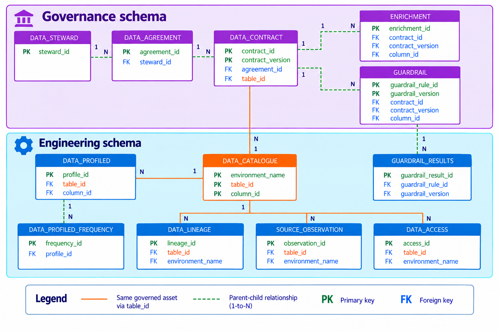

# List of Metadata Tables

FabricOps metadata tables describe the governed workflow evidence written by the notebook templates. These pages are generated from the implemented metadata setup schema registry used by `00_env_config`.

The diagram below shows how the FabricOps metadata tables relate to one another across agreement, profiling, guardrail, lineage, and pipeline-run evidence.

## Metadata tables

<a class="metadata-table-card" href="metadata_data_steward/" aria-label="Open METADATA_DATA_STEWARD schema">
  
    METADATA_DATA_STEWARD
    →
  
  Know who is responsible for the data.
  
    <strong>Grain</strong>
    One registered Data Steward.
  
  
    <strong>Primary key</strong>
    <code>steward_id</code>
  
  
    
      Used by
      1 table
    
    
      1 → N
      
        <code>METADATA_DATA_AGREEMENT</code>
      
    
  
</a>
<a class="metadata-table-card" href="metadata_data_agreement/" aria-label="Open METADATA_DATA_AGREEMENT schema">
  
    METADATA_DATA_AGREEMENT
    →
  
  Define why the data is shared, with whom, and under what conditions.
  
    <strong>Grain</strong>
    One version of one Data Agreement.
  
  
    <strong>Primary key</strong>
    <code>agreement_id</code> + <code>agreement_version</code>
  
  
    
      Used by
      1 table
    
    
      1 → N
      
        <code>METADATA_DATA_CONTRACT</code>
      
    
  
</a>
<a class="metadata-table-card" href="metadata_data_contract/" aria-label="Open METADATA_DATA_CONTRACT schema">
  
    METADATA_DATA_CONTRACT
    →
  
  Define what the data is, how it looks, its sensitivity, quality requirements, schema, freshness, approved usages, and link it to the Data Agreement.
  
    <strong>Grain</strong>
    One immutable Data Contract version for one governed table under one exact Data Agreement version.
  
  
    <strong>Primary key</strong>
    <code>contract_id</code> + <code>contract_version</code>
  
  
    
      Used by
      0 tables
    
    No downstream tables.
  
</a>
<a class="metadata-table-card" href="metadata_data_catalogue/" aria-label="Open METADATA_DATA_CATALOGUE schema">
  
    METADATA_DATA_CATALOGUE
    →
  
  The current structural registry of known table and column assets. table_id identifies the logical table, and column_id identifies the logical column while its normalized column name remains the same. data_type stores the current structural datatype, and is_active indicates whether the asset currently exists. Datatype changes preserve column_id, removed columns become inactive, and returning columns reuse their deterministic ID. METADATA_DATA_PROFILED retains historical observations.
  
    <strong>Grain</strong>
    One table or column asset in one environment.
  
  
    <strong>Primary key</strong>
    <code>environment_name</code> + <code>table_id</code> + <code>column_id</code>
  
  
    
      Used by
      7 tables
    
    
      1 → N
      
        <code>METADATA_DATA_CONTRACT</code>
        <code>METADATA_SOURCE_OBSERVATION</code>
        <code>METADATA_DATA_PROFILED</code>
        <code>METADATA_DATA_LINEAGE</code>
        <code>METADATA_ENRICHMENT</code>
        <code>METADATA_DATA_ACCESS</code>
        <code>METADATA_GUARDRAIL</code>
      
    
  
</a>
<a class="metadata-table-card" href="metadata_source_observation/" aria-label="Open METADATA_SOURCE_OBSERVATION schema">
  
    METADATA_SOURCE_OBSERVATION
    →
  
  See what FabricOps previously observed about the source data.
  
    <strong>Grain</strong>
    One partition observation within one source-table observation.
  
  
    <strong>Primary key</strong>
    <code>observation_id</code> + <code>partition_value</code>
  
  
    
      Used by
      0 tables
    
    No downstream tables.
  
</a>
<a class="metadata-table-card" href="metadata_data_profiled/" aria-label="Open METADATA_DATA_PROFILED schema">
  
    METADATA_DATA_PROFILED
    →
  
  See the column-level profile metrics captured for a dataset snapshot.
  
    <strong>Grain</strong>
    One observed column in one profiling snapshot.
  
  
    <strong>Primary key</strong>
    <code>profile_id</code>
  
  
    
      Used by
      2 tables
    
    
      1 → N
      
        <code>METADATA_DATA_PROFILED_FREQUENCY</code>
        <code>METADATA_DATA_LINEAGE</code>
      
    
  
</a>
<a class="metadata-table-card" href="metadata_data_profiled_frequency/" aria-label="Open METADATA_DATA_PROFILED_FREQUENCY schema">
  
    METADATA_DATA_PROFILED_FREQUENCY
    →
  
  See the frequency distribution captured for a profiled column.
  
    <strong>Grain</strong>
    One flattened ranked value within one logical frequency distribution for a column Profile.
  
  
    <strong>Primary key</strong>
    <code>frequency_id</code>
  
  
    
      Used by
      0 tables
    
    No downstream tables.
  
</a>
<a class="metadata-table-card" href="metadata_data_lineage/" aria-label="Open METADATA_DATA_LINEAGE schema">
  
    METADATA_DATA_LINEAGE
    →
  
  See where the data came from and where it ends up.
  
    <strong>Grain</strong>
    One table participating as a source or target in one pipeline/profiling execution.
  
  
    <strong>Primary key</strong>
    <code>lineage_id</code>
  
  
    
      Used by
      0 tables
    
    No downstream tables.
  
</a>
<a class="metadata-table-card" href="metadata_enrichment/" aria-label="Open METADATA_ENRICHMENT schema">
  
    METADATA_ENRICHMENT
    →
  
  Add business and governance context to the data.
  
    <strong>Grain</strong>
    One appended enrichment value for one table or column identity in one environment.
  
  
    <strong>Primary key</strong>
    <code>enrichment_id</code>
  
  
    
      Used by
      0 tables
    
    No downstream tables.
  
</a>
<a class="metadata-table-card" href="metadata_data_access/" aria-label="Open METADATA_DATA_ACCESS schema">
  
    METADATA_DATA_ACCESS
    →
  
  See who has row-level access to the data.
  
    <strong>Grain</strong>
    One RLS assignment for one user and one Catalogue table in one environment.
  
  
    <strong>Primary key</strong>
    <code>access_id</code>
  
  
    
      Used by
      0 tables
    
    No downstream tables.
  
</a>
<a class="metadata-table-card" href="metadata_guardrail/" aria-label="Open METADATA_GUARDRAIL schema">
  
    METADATA_GUARDRAIL
    →
  
  Define the expectations the data used in the ETL pipeline should meet.
  
    <strong>Grain</strong>
    One configured Guardrail rule for one Catalogue table or column in one environment.
  
  
    <strong>Primary key</strong>
    <code>guardrail_rule_id</code> + <code>guardrail_version</code>
  
  
    
      Used by
      1 table
    
    
      1 → N
      
        <code>METADATA_GUARDRAIL_RESULTS</code>
      
    
  
</a>
<a class="metadata-table-card" href="metadata_guardrail_results/" aria-label="Open METADATA_GUARDRAIL_RESULTS schema">
  
    METADATA_GUARDRAIL_RESULTS
    →
  
  See whether the expectations of the data in the ETL pipeline run are met.
  
    <strong>Grain</strong>
    One runtime outcome for one Guardrail rule in one pipeline run.
  
  
    <strong>Primary key</strong>
    <code>guardrail_result_id</code>
  
  
    
      Used by
      1 table
    
    
      1 → N
      
        <code>METADATA_GUARDRAIL_ROW_RESULTS</code>
      
    
  
</a>
<a class="metadata-table-card" href="metadata_guardrail_row_results/" aria-label="Open METADATA_GUARDRAIL_ROW_RESULTS schema">
  
    METADATA_GUARDRAIL_ROW_RESULTS
    →
  
  See the individual records that failed a Data Quality rule.
  
    <strong>Grain</strong>
    One failed record belonging to one Guardrail Result.
  
  
    <strong>Primary key</strong>
    <code>guardrail_row_result_id</code>
  
  
    
      Used by
      0 tables
    
    No downstream tables.
  
</a>

