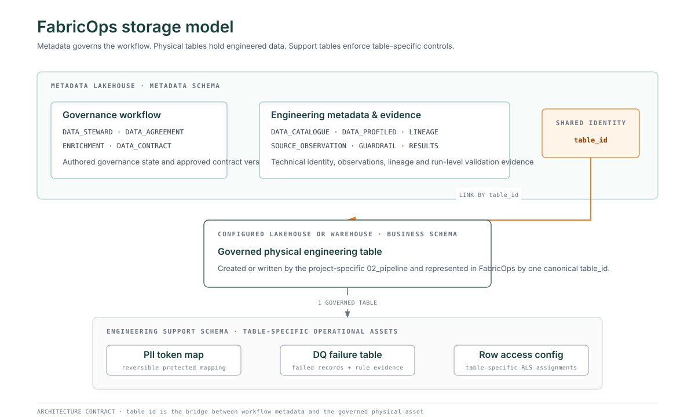

# FabricOps storage model

FabricOps separates workflow metadata, engineered data, and table-specific operational controls so each kind of state has one clear home.



## The three storage layers

### 1. FabricOps metadata

**The metadata schema records how a governed `table_id` moves through the FabricOps Governance and Engineering workflow.**

These tables live in the configured Metadata Lakehouse under the metadata schema. They describe governance state, technical identity, engineering observations, lineage, validation evidence, and Data Contract lifecycle information.

Typical examples include:

* `METADATA_DATA_STEWARD`
* `METADATA_DATA_AGREEMENT`
* `METADATA_DATA_CONTRACT`
* `METADATA_DATA_CATALOGUE`
* `METADATA_DATA_PROFILED`
* `METADATA_DATA_PROFILED_FREQUENCY`
* `METADATA_DATA_LINEAGE`
* `METADATA_SOURCE_OBSERVATION`
* `METADATA_ENRICHMENT`
* `METADATA_GUARDRAIL`
* `METADATA_GUARDRAIL_RESULTS`

The [Metadata Tables reference](metadata.md) remains the exact implemented schema reference for these tables.

### 2. Governed physical engineering tables

**The actual project data belongs in the configured Lakehouse or Warehouse, not in the Metadata Lakehouse.**

`02_pipeline` reads, transforms, and writes project-specific data into the configured physical target. A target table is represented in FabricOps by one canonical `table_id`, which is recorded in the Data Catalogue and reused throughout the governance and engineering loop.

The physical table keeps its project-specific table name and business schema. FabricOps does not require business data to be moved into the metadata schema.

### 3. Table-specific engineering support

**Operational controls that act on the rows of one governed table belong beside that table in an engineering support schema.**

The target architecture uses one support set for each governed `table_id` where the capability is required:

| Support asset | Purpose | Relationship to governed table |
| --- | --- | --- |
| PII token map | Holds reversible mappings used when Direct PII is tokenised. | One table-specific token map for one governed `table_id`. |
| DQ failure table | Holds failed records and the runtime rule evidence required to investigate them. | One table-specific failure table for one governed `table_id`. |
| Row access configuration | Holds row-level assignments used to enforce RLS for that physical dataset. | One table-specific RLS configuration for one governed `table_id`. |

These support tables are operational engineering assets. They are not part of the FabricOps metadata model even when they retain identifiers such as `table_id`, `guardrail_result_id`, or runtime audit fields for traceability.

## `table_id` is the bridge

The canonical `table_id` links the workflow to the physical asset without mixing their storage responsibilities.

```text
FabricOps metadata
       │
       │ table_id
       ▼
Governed physical table
       │
       ├── PII token map
       ├── DQ failure table
       └── row access configuration
```

This gives FabricOps one stable identity for the governed table while allowing metadata, project data, and operational control data to follow different storage and security requirements.

## Access has two different meanings

FabricOps must keep platform access and row access separate.

| Concern | Intended home |
| --- | --- |
| Who has permission to access the physical table through Fabric or SQL grants | FabricOps metadata, represented by `METADATA_DATA_ACCESS` after its access contract is corrected |
| Which rows an authorised user may see | Table-specific row access configuration in the engineering support schema |

The first is governance and platform access evidence. The second is runtime data enforcement for one dataset.

## Guardrail results and failed rows

Run-level Guardrail outcomes are workflow evidence and therefore belong in metadata:

```text
METADATA_GUARDRAIL
        │
        ▼
METADATA_GUARDRAIL_RESULTS
```

Actual failed records are operational row data. The target architecture stores those records in the table-specific DQ failure table while retaining `guardrail_result_id` so each failed record can be traced back to the metadata result that produced it.

!!! important "Current implementation versus target architecture"

    This page defines the storage boundary FabricOps is moving toward. Latest `main` still contains two known exceptions that will be corrected in focused implementation PRs:

    * `METADATA_GUARDRAIL_ROW_RESULTS` currently stores row-level DQ failure evidence in the Metadata Lakehouse.
    * `METADATA_DATA_ACCESS` currently models row-level access assignments rather than physical table grant evidence.

    The generated [Metadata Tables reference](metadata.md) continues to describe the current implementation exactly until those runtime and schema changes land.

## Architecture rules

1. Workflow metadata stays in the Metadata Lakehouse metadata schema.
2. Project data stays in its configured Lakehouse or Warehouse business schema.
3. Row-bearing enforcement artefacts stay with the governed physical dataset in an engineering support schema.
4. One canonical `table_id` identifies the governed physical table across all three layers.
5. Support assets must not become a second metadata model. They exist to enforce or operate the physical dataset.
6. Sensitive support assets, especially reversible PII mappings, require permissions appropriate to their contents rather than inheriting broad metadata access.

## Related references

* [How FabricOps works](../how-fabricops-works.md)
* [FabricOps Engineering](engineering-cheat-sheet.md)
* [Metadata Tables](metadata.md)
* [DQ Rules](dq-rules/index.md)
