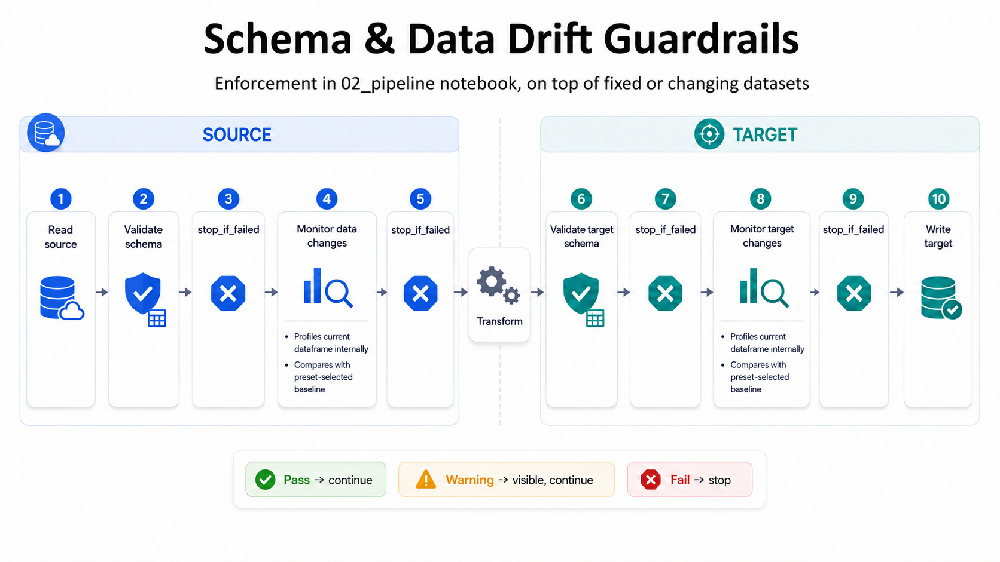

# Pipeline Guardrails

Pipeline guardrails are checks inside `02_pipeline` that help decide whether a run should continue, warn, or stop before writing outputs.

Read [How FabricOps Works](how-fabricops-works/index.md) first for the standard `01_agreement` → `02_pipeline` → `03_review` path. This page focuses on the guardrails that the pipeline owns.

{ .full-width }

## What `02_pipeline` checks

A typical `02_pipeline` can check:

- source schema before transformations run;
- source data changes against previous profile evidence;
- transformed target schema before outputs are written;
- target data changes before outputs are written;
- approved active DQ rules from `METADATA_DQ_RULES` before outputs are written.

The important boundary is that `02_pipeline` owns blocking behavior. `03_review` can provide reviewed metadata, but it does not stop a run by itself.

## Guardrail flow

| Point in the run | What happens | Why it matters |
| --- | --- | --- |
| Before transform | Check the source schema and source profile. | Catch unexpected input changes early. |
| During transform | Apply deterministic business logic. | Keep the output repeatable. |
| Before write | Check the target schema, target profile, and approved active DQ rules. | Avoid publishing unexpected output changes or error-severity DQ failures. |
| After successful checks | Write outputs and metadata evidence. | Keep review and support grounded in what actually ran. |

## Compact starter pattern

Use a simple pattern first, then add stricter checks only when the team needs them:

```python
# 1. Load environment config and source data.
# 2. Validate the source schema.
# 3. Profile source data and compare it with previous metadata evidence.
# 4. Transform the data.
# 5. Validate and profile the proposed target.
# 6. Enforce approved active DQ rules as aggregate guardrails.
# 7. Stop or warn based on configured guardrails.
# 8. Write the full target only after required checks pass.
# 9. Record profile, lineage, and run metadata evidence.
```


## DQ guardrail behavior

`03_review` records human-approved DQ expectations in `METADATA_DQ_RULES`. `02_pipeline` reads the active approved rules for the target table and evaluates them with the same simple guardrail contract used by schema and data-change checks:

- `status`: `passed`, `warning`, or `failed`;
- `can_continue`: whether publication can proceed;
- `checks`: aggregate rule-level outcomes;
- `message`: a concise summary.

Severity controls the result:

| Rule outcome | Guardrail result | Pipeline behavior |
| --- | --- | --- |
| No rule failures | `passed`, `can_continue=True` | Continue and write the full target dataset. |
| Warning-severity failure | `warning`, `can_continue=True` | Log the warning result and write the full target dataset. |
| Error-severity failure | `failed`, `can_continue=False` | `stop_if_failed(...)` blocks before the target write. |
| Mixed warning and error failures | `failed`, `can_continue=False` | Error severity wins and blocks before the target write. |

FabricOps v1 keeps DQ enforcement intentionally simple. It does not quarantine rows, write row-level failure tables, filter invalid rows out of the target, send alerts, or perform partial target writes. Aggregated DQ guardrail results can feed dashboards and alerts later without changing the target write path.

## Presets

### Schema presets

| Preset | Use when | Behavior in plain language |
| --- | --- | --- |
| `strict` | Production outputs must match the expected schema. | Stop when columns or data types do not match. |
| `allow_new_columns` | New fields are acceptable, but existing fields still matter. | Allow additional columns while still checking known columns. |
| `monitor_only` | A team wants visibility before blocking runs. | Record schema differences without stopping the pipeline. |

### Data-change presets

| Preset | Use when | Behavior in plain language |
| --- | --- | --- |
| `changing_data` | Data is expected to change from run to run. | Watch for unusual changes while allowing normal movement. |
| `fixed_data` | Data should stay stable. | Treat unexpected movement as more serious. |
| `monitor_changing_data` | The team wants to learn normal change patterns first. | Record changes without blocking. |
| `monitor_fixed_data` | The team wants visibility on stable data before blocking. | Monitor stable-data expectations without stopping the run. |

Start with monitor settings when the team is still learning the data. Move to blocking settings only when the expected behavior is clear.

## Metadata evidence for review

When guardrails run, `02_pipeline` should record useful metadata evidence such as:

- the schema that was checked;
- profile results;
- whether checks passed, warned, or failed;
- aggregate DQ rule outcomes when approved active rules were evaluated;
- source and target table context;
- lineage and run context.

This evidence helps `03_review`, support teams, and future maintainers understand what the pipeline checked and why it did or did not write outputs.

## What this is not

Pipeline guardrails are not a separate data contract framework and FabricOps v1.0.0 does not require separate data contracts. Keep the operating model lightweight: the pipeline notebook owns the checks it runs, and reviewed metadata can inform those checks when intentionally implemented.
