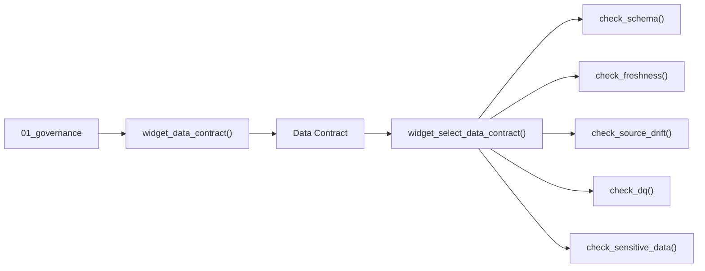

# AI-assisted Data Contract Authoring

FabricOps uses profile evidence and Microsoft Fabric AI Functions to assist Data Contract authoring without making Governance approval or runtime enforcement AI-dependent.


## What it helps author

AI can assist with table and column descriptions, Grain & Row Key suggestions, Sensitive Data assessment and treatment, Pattern generation, and other authoring tasks where interpretation is useful.

The suggestion is never the governed result by itself. Governance reviews the proposed state before applying it to the Data Contract.

## What is a Data Contract in FabricOps?

**The Data Contract is the versioned governance definition for a governed table, not passive documentation beside the pipeline.**

Governance authors it through [`widget_data_contract()`](../api/reference/widget_data_contract.md) in `01_governance`. The widget works from the selected `table_id` and brings together:

- **Enrichment** for descriptive table and column metadata and information classification
- **Guardrails** for enforceable expectations such as Schema, Freshness, Source Drift, Data Quality, and Sensitive Data requirements
- the governed target processing definition, including its load strategy and parameters
- the logical notebook ownership that identifies which pipeline owns the governed write

Engineering sets the contract context in `02_pipeline` through [`widget_select_data_contract()`](../api/reference/widget_select_data_contract.md). In Development, an engineer can select an eligible immutable version for each linked `table_id`; in Production, FabricOps ignores overrides and resolves exactly one active version automatically.

The selected or active Data Contract is then **enforced in Engineering through the FabricOps Guardrail functions**:

- [`check_schema()`](../api/reference/check_schema.md) enforces Schema Guardrails
- [`check_freshness()`](../api/reference/check_freshness.md) enforces Freshness Guardrails
- [`check_source_drift()`](../api/reference/check_source_drift.md) explicitly enforces Source Drift for each source-to-target relationship before publication
- [`check_dq()`](../api/reference/check_dq.md) enforces Data Quality Guardrails
- [`check_sensitive_data()`](../api/reference/check_sensitive_data.md) enforces Sensitive Data Guardrails before governed publication



That is the core **Governance as Code** idea in FabricOps: Governance authors the definition once, Engineering explicitly selects or resolves it, and the pipeline functions execute those governed expectations against the real data flow.

??? info "Read more: what exactly is authored and activated?"

    ```mermaid
    flowchart LR
        TABLE["table_id"] --> AUTHOR["widget_data_contract()"]
        AUTHOR --> CONTRACT["Data Contract version<br/>Enrichment · Guardrails · Processing"]
        CONTRACT --> ACTIVATE["widget_data_contract()"]
        AGREEMENT["Data Agreement version"] --> ACTIVATE
        ACTIVATE --> ACTIVE["ACTIVE for Production"]
    ```

    **Enrichment** is descriptive. It helps people and downstream systems understand what the table and columns mean and how the information is classified.

    **Guardrails** are enforceable expectations. Examples include Schema, Freshness, Source Drift, Data Quality, and Sensitive Data handling. A Guardrail can use a **Warn** or **Block** action.

    Activation links the approved Data Contract version to the relevant Data Agreement version so Production has one explicit governed definition to resolve.

## Why it matters

The goal is to reduce repetitive contract authoring while keeping the contract itself explicit, reviewable, versioned, and deterministic.

For the hands-on workflow, see [Step 3: Author and freeze the Data Contract](../guided-demo/03-author-and-freeze-data-contract.md).
