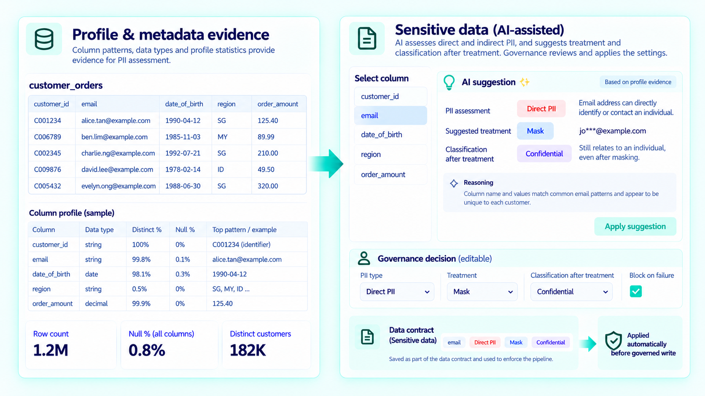
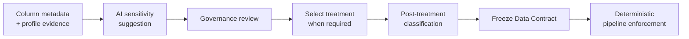

# Direct & Indirect PII Discovery & Treatment with Built-in AI Suggestions



## The problem

Identifying sensitive data is only the first step. The more important governance decision often comes next: what should happen to that data?

Governance users still need to decide how Direct or Indirect PII should be treated and understand what its classification becomes after that treatment is applied.

## The solution

FabricOps turns sensitive-data governance into a three-step workflow:

1. **Identify sensitivity** — tag each governed column as **Direct PII**, **Indirect PII**, or **Not PII**.
2. **Apply treatment** — for sensitive columns, choose how the data should be handled before publication. FabricOps supports **Mask, Bucket, Tokenize, and Remove**.
3. **Classify the governed output** — record the classification that applies **after treatment**, so it describes the data downstream consumers actually receive.

**Sensitivity → Treatment → Post-treatment Classification**

These decisions are captured in the Data Contract. Once the reviewed contract is frozen, validated, and activated, FabricOps applies the approved treatment deterministically in the data pipeline.

### AI-assisted authoring

FabricOps taps into Microsoft Fabric AI capabilities to make the authoring workflow faster. Using the metadata and profiling evidence FabricOps has already captured, AI can provide a first-pass suggestion for whether a column contains **Direct PII**, **Indirect PII**, or **Not PII** and, for sensitive columns, suggest one of the four supported treatments.

Governance reviews and can change those suggestions, then records the final post-treatment classification. Classification is deliberately not inferred automatically by the current AI suggestion path; it remains an explicit governance decision describing the governed output.

AI therefore accelerates the workflow without becoming the governance authority: **AI suggests → Governance decides → Data Contract records → Pipeline enforces**.

## How it works



## What Governance decides

For each governed column, FabricOps presents sensitivity, treatment, and classification together because the classification should describe the data that downstream users actually receive.

| Decision | Meaning |
| --- | --- |
| **Sensitivity** | Whether the column is Direct PII, Indirect PII, or Not PII |
| **Treatment** | The transformation Governance chooses for sensitive data before publication |
| **Classification** | The governed classification of the column after the selected treatment is applied |

For example, a Direct PII column may require treatment before publication. Once that treatment is selected, Governance records the classification appropriate to the resulting column. A non-PII column with no treatment can simply retain the classification appropriate to its state.

## Where AI helps

Sensitive Data governance does not depend on AI.

When enabled, Fabric AI Functions use the available column metadata and profiling context to help assess Direct PII, Indirect PII, or Not PII. Governance reviews the suggestion and remains responsible for the governed treatment and classification.

Grain & Row Key candidates are derived deterministically from profile evidence. Business-language translation into enforceable Data Quality rules is a separate AI-assisted workflow; see [Generate Enforceable Data Quality Rules from Business Rules](business-rules-to-data-quality.md).

<details markdown="1">
<summary><strong>Under the hood: how AI sensitivity suggestions are produced</strong></summary>

### What FabricOps gives the AI

FabricOps does not send the whole source table. It builds a compact context from governed metadata and profiling evidence, including the table identity and description plus each column's name, data type, description, current classification, profile statistics, and limited frequency evidence.

Raw business-table rows are not included in this context.

### How Fabric AI Functions are used

FabricOps places the complete instruction into a single-row temporary pandas DataFrame with one column named `fabricops_prompt`, then invokes Microsoft Fabric AI Functions through:

```python
frame.ai.generate_response("{fabricops_prompt}")
```

This is a one-row AI request. The DataFrame is only the interface used to invoke Fabric AI Functions; FabricOps is not asking the model to process the business table row by row.

The response is expected as structured JSON covering the supplied columns. Before a suggestion is shown, FabricOps validates that referenced columns exist and that the returned sensitivity values use the supported **Direct PII**, **Indirect PII**, or **Not PII** model.

The suggestion remains transient authoring assistance. Governance reviews what should enter the Data Contract; saving, freezing, activation, and runtime enforcement remain explicit FabricOps lifecycle actions.

For the canonical persisted schema and runtime behaviour, use [METADATA_DATA_CONTRACT](../reference/metadata/metadata_data_contract.md), [METADATA_GUARDRAIL](../reference/metadata/metadata_guardrail.md), and [Sensitive Data Treatments](../reference/sensitive-data-treatments.md).

</details>

## Runtime enforcement

Sensitive Data is a write-side Guardrail. Once a reviewed Data Contract is frozen, validated, and activated, the pipeline applies the governed treatment deterministically through [`check_sensitive_data()`](../api/reference/check_sensitive_data.md) before publication.

FabricOps supports **Mask, Bucket, Tokenize, and Remove**. See [Sensitive Data Treatments](../reference/sensitive-data-treatments.md) for the exact runtime behaviour.

The separation is deliberate: **AI helps surface potential sensitive data; Governance decides the governed outcome; FabricOps enforces the approved contract deterministically.**

## Go deeper

For the authoring workflow, see [Step 3: Author and freeze the Data Contract](../guided-demo/03-author-and-freeze-data-contract.md).

For the persisted contract schema, see [METADATA_DATA_CONTRACT](../reference/metadata/metadata_data_contract.md).
