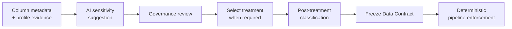

# Direct & Indirect PII Discovery & Treatment with Built-in AI Suggestions

## The problem

Sensitive-data governance is easy to make either too manual or too opaque. Governance users need to identify Direct and Indirect PII, decide how it should be treated, and understand the resulting classification without handing those decisions over to AI.

## The solution

FabricOps keeps the governed decisions explicit while using Microsoft Fabric AI Functions as an optional authoring aid.

AI can suggest whether a column is **Direct PII**, **Indirect PII**, or **Not PII** from the available metadata and profile context. Governance reviews that suggestion, selects the treatment when one is required, and sees the classification that applies **after treatment**.

The workflow remains usable without AI. Suggestions accelerate review; they do not replace Governance approval or deterministic runtime enforcement.

## How it works

## What Governance decides

For each governed column, FabricOps keeps sensitivity and classification together because the final classification depends on the governed treatment.

| Decision | Meaning |
| --- | --- |
| **Sensitivity** | Whether the column is Direct PII, Indirect PII, or Not PII |
| **Treatment** | The transformation Governance chooses for sensitive data before publication |
| **Classification** | The governed classification of the column after the selected treatment is applied |

This means classification is not an independent AI label. It describes the state that downstream users receive after the write-side Sensitive Data Guardrail has been applied.

For example, a Direct PII column may require treatment before publication, while a non-PII column with no treatment can remain at the classification appropriate to its resulting state. The Data Contract records the reviewed combination rather than treating sensitivity, treatment, and classification as unrelated fields.

## Where AI helps

Sensitive Data governance does not depend on AI.

When enabled, Fabric AI Functions use the available column metadata and profiling context to propose a sensitivity assessment. Governance can accept or change the proposal and manually selects the treatment.

AI does **not**:

- choose the final governed treatment;
- make the Data Contract authoritative by itself;
- determine Grain & Row Key candidates, which are derived deterministically from profile evidence; or
- replace runtime Guardrail enforcement.

Business-language translation into enforceable Data Quality rules is a separate AI-assisted workflow. See [Generate Enforceable Data Quality Rules from Business Rules](business-rules-to-data-quality.md).

## Runtime enforcement

Sensitive Data is a write-side Guardrail. Once a reviewed Data Contract is frozen, validated, and activated, the pipeline applies the governed treatment deterministically through [`check_sensitive_data()`](../api/reference/check_sensitive_data.md) before publication.

FabricOps supports **Mask, Bucket, Tokenize, and Remove**. See [Sensitive Data Treatments](../reference/sensitive-data-treatments.md) for the exact runtime behavior.

The separation is deliberate: **AI can help identify sensitive data; Governance decides the treatment and resulting governed state; FabricOps enforces the approved contract deterministically.**

## Go deeper

For the authoring workflow, see [Step 3: Author and freeze the Data Contract](../guided-demo/03-author-and-freeze-data-contract.md).

For the persisted contract schema, see [METADATA_DATA_CONTRACT](../reference/metadata/metadata_data_contract.md).
