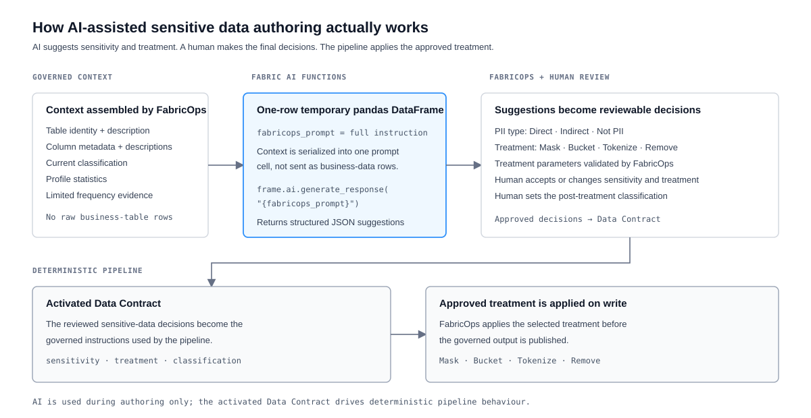

# Direct & Indirect PII Discovery & Treatment with Built-in AI Suggestions


## The problem

Identifying sensitive data is only the first step. The more important governance decision often comes next: what should happen to that data?

Governance users still need to decide how Direct or Indirect PII should be treated and understand what its classification becomes after that treatment is applied.

## The solution

FabricOps turns sensitive-data governance into a three-step workflow:

1. **Identify sensitivity** — tag each governed column as **Direct PII**, **Indirect PII**, or **Not PII**.
2. **Apply treatment** — for sensitive columns, choose how the data should be handled before publication. FabricOps supports **Mask, Bucket, Tokenize, and Remove**.
3. **Classify the governed output** — record the classification that applies **after treatment**, so it describes the data downstream consumers actually receive.

These decisions are captured in the Data Contract. Once the reviewed contract is frozen, validated, and activated, FabricOps applies the approved treatment deterministically in the data pipeline.

### AI-assisted authoring

FabricOps taps into Microsoft Fabric AI capabilities to make the authoring workflow faster. Using the metadata and profiling evidence FabricOps has already captured, AI can provide a first-pass suggestion for whether a column contains **Direct PII**, **Indirect PII**, or **Not PII** and, for sensitive columns, suggest one of the four supported treatments.

Governance reviews and can change those suggestions, then records the final post-treatment classification. Classification is deliberately not inferred automatically by the current AI suggestion path; it remains an explicit governance decision describing the governed output.

AI therefore accelerates the workflow, while the final decision lies with a human: **AI suggests → Human decides → Data Contract records → Pipeline enforces**.

## How it works

FabricOps separates the parts that need human judgement from the parts AI can accelerate and the parts the platform can enforce consistently.

| Responsibility | What happens |
| --- | --- |
| **Human configures and decides** | Review or change the sensitivity and treatment for each governed column, then record the final post-treatment classification. |
| **AI supports** | Uses governed metadata and profile evidence to suggest **Direct PII**, **Indirect PII**, or **Not PII** and, for sensitive columns, a supported treatment and parameters. |
| **FabricOps handles deterministically** | Validates supported values and treatment parameters, records the reviewed decisions in the Data Contract, and applies the approved **Mask, Bucket, Tokenize, or Remove** treatment when the pipeline writes the governed output. |

<details markdown="1">
<summary><strong>Under the hood: how AI suggestions and enforcement work</strong></summary>

### What FabricOps gives the AI

FabricOps does not send the whole source table. It builds a compact context from governed metadata and profiling evidence, including the table identity and description plus each column's name, data type, description, current classification, profile statistics, and limited frequency evidence.

Raw business-table rows are not included in this context.

### How Fabric AI Functions are used



FabricOps places the complete instruction into a single-row temporary pandas DataFrame with one column named `fabricops_prompt`, then invokes Microsoft Fabric AI Functions through:

```python
frame.ai.generate_response("{fabricops_prompt}")
```

This is a one-row AI request. The DataFrame is only the interface used to invoke Fabric AI Functions; FabricOps is not asking the model to process the business table row by row.

The response is expected as structured JSON covering the supplied columns, including the suggested PII type, reason, treatment, action, and treatment parameters. Before a suggestion is shown, FabricOps validates the returned columns and values against the supported sensitive-data model.

### How the approved decision is enforced

The AI suggestion is authoring assistance only. A human reviews or changes the sensitivity and treatment, then records the final post-treatment classification.

Once the reviewed Data Contract is frozen, validated, and activated, FabricOps uses those approved decisions when the pipeline writes the data. For example, a column approved for masking is masked before the governed output is published. The AI is not asked to make the decision again during pipeline execution.

For the canonical persisted schema and treatment behaviour, use [METADATA_DATA_CONTRACT](../reference/metadata/metadata_data_contract.md), [METADATA_GUARDRAIL](../reference/metadata/metadata_guardrail.md), and [Sensitive Data Treatments](../reference/sensitive-data-treatments.md).

</details>

## Example

<details markdown="1">
<summary><strong>Example: protecting a sensitive customer column</strong></summary>

Suppose profiling and metadata show a customer column that contains sensitive identifying information.

1. **AI supports the first pass.** FabricOps provides the governed metadata and profile evidence to Fabric AI Functions, which can suggest that the column is **Direct PII** and propose one of the supported treatments.
2. **A human makes the final decision.** The reviewer can accept or change the sensitivity and treatment, configure any required treatment parameters, and record the appropriate post-treatment classification.
3. **The Data Contract records the decision.** The reviewed configuration becomes part of the governed contract rather than remaining an AI response.
4. **FabricOps applies it consistently.** After the contract is activated, the pipeline applies the approved treatment before publishing the governed output.

The same pattern applies to **Mask, Bucket, Tokenize, and Remove**: AI can accelerate authoring, a human owns the final decision, and FabricOps performs the approved treatment deterministically.

</details>

## Go deeper

For the authoring workflow, see [Step 3: Author and freeze the Data Contract](../guided-demo/03-author-and-freeze-data-contract.md).

For the supported Mask, Bucket, Tokenize, and Remove behaviour, see [Sensitive Data Treatments](../reference/sensitive-data-treatments.md).

For the persisted contract schema, see [METADATA_DATA_CONTRACT](../reference/metadata/metadata_data_contract.md).
