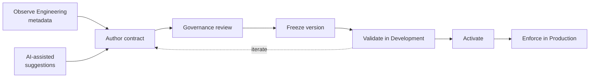

# Direct & Indirect PII Discovery & Treatment with Built-in AI Suggestions

## The problem

A useful Data Contract has to combine what Engineering actually produced with Governance decisions about meaning, quality, sensitivity, and acceptable behaviour. Recreating technical metadata manually is slow, while allowing AI-generated suggestions to become policy automatically would make the governed definition difficult to trust and review.

## The solution

FabricOps makes the Data Contract explicit, versioned, and executable. Microsoft Fabric AI Functions can assist where interpretation is useful, while deterministic FabricOps metadata and Governance decisions remain the source of truth.

The contract combines the observed Engineering definition with Governance-owned decisions rather than asking users to recreate technical metadata manually.

## How it works

## Implementation details

### The governed contract behind the workflow

The Sensitive Data decision is saved as part of the same versioned Data Contract used by Engineering. The contract reference owns the exact persisted schema, while the function references own runtime behaviour.

For the canonical technical definitions, use:

- [METADATA_DATA_CONTRACT](../reference/metadata/metadata_data_contract.md) for the persisted contract schema.
- [METADATA_GUARDRAIL](../reference/metadata/metadata_guardrail.md) for persisted Guardrail definitions.
- [Sensitive Data Treatments](../reference/sensitive-data-treatments.md) for the supported treatments and exact runtime behaviour.
- [Function Reference](../reference/index.md) for the checks and orchestration functions that enforce the frozen contract.

For the end-to-end author → freeze → validate → activate → enforce lifecycle, see [How FabricOps Works](../how-fabricops-works.md) and the [Guided Demo](../guided-demo.md).

### Where AI helps

Sensitive Data governance does not depend on AI. Governance can classify and configure treatment manually. AI is an optional authoring aid; it is **not the enforcement engine**.

Governance can author descriptions, classifications, and Sensitive Data treatments manually. When enabled, Fabric AI Functions can use Data Catalogue and profiling context to suggest descriptions, classifications, and Sensitive Data classification/treatment choices. Grain & Row Key candidates are derived deterministically from profile evidence, not AI. Business-language translation into enforceable Data Quality rules is a separate AI-assisted workflow; see [Generate Enforceable Data Quality Rules from Business Rules](business-rules-to-data-quality.md).

Governance reviews those suggestions in the same authoring workflow as manually entered decisions. Once accepted into a frozen Data Contract, enforcement is deterministic through the FabricOps Guardrail functions.

That separation is intentional: **manual Governance authoring is always available; AI can accelerate interpretation-heavy authoring; the approved Data Contract remains explicit and reviewable; Engineering enforcement remains deterministic.**

## Go deeper

For the hands-on workflow, see [Step 3: Author and freeze the Data Contract](../guided-demo/03-author-and-freeze-data-contract.md).

For the persisted contract schema, see [METADATA_DATA_CONTRACT](../reference/metadata/metadata_data_contract.md).
