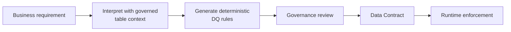

# Generate Enforceable Data Quality Rules from Business Rules

## The problem

Business requirements are usually written for people, not validation engines. Engineering still has to translate statements such as what must be unique, complete, related, or allowed into explicit Data Quality rules before those expectations can be enforced consistently.

## The solution

Write a business requirement in plain language. FabricOps can decompose it into one or more reviewable, enforceable Data Quality rules.

Business intent stays readable while Engineering receives an explicit rule shape that can actually be validated and enforced.

## How it works

## Implementation details

Governance describes what must be true in business language. FabricOps uses the governed table definition, column metadata, profile evidence, and existing DQ rules to resolve the intent into the smallest set of independent deterministic Data Quality rules. Relevant columns are inferred by default; an optional multi-select can constrain generation when needed.

Known FabricOps rule patterns are preferred first, including Uniqueness, Column Relationship, Conditional Completeness, and Conditional Values. A constrained Custom Expression is used only when the requirement cannot be represented faithfully by a standard pattern.

Each resulting rule is reviewed by a human before it enters the Data Contract. Rules authored directly from the Columns page and rules generated from natural language share the same draft DQ rule collection. Runtime enforcement remains deterministic.

A future screen recording will show the full flow from plain-language requirement to reviewed DQ rules.

## Go deeper

For the hands-on workflow, see [Step 3: Author and freeze the Data Contract](../guided-demo/03-author-and-freeze-data-contract.md).
