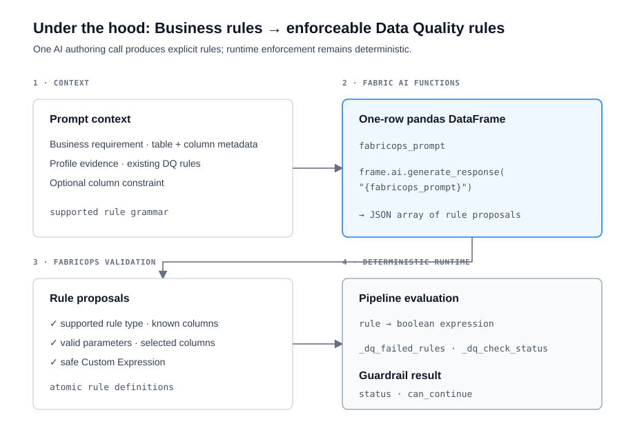

# Data Quality Rules


## The problem

Data Quality expectations often begin as business language: what must be present, which values are valid, how columns relate, or what should be true only under certain conditions. Engineering then has to turn that intent into executable checks.

FabricOps keeps the business requirement readable while converting it into explicit Data Quality rules that can be reviewed in the Data Contract and enforced deterministically in the pipeline.

## The rule patterns

FabricOps gives the AI a bounded rule grammar rather than asking it to invent arbitrary validation logic.

| Pattern | What it expresses |
| --- | --- |
| **Completeness** | Maximum missing percentage for one column, with explicit blank handling. |
| **Uniqueness** | One column or a combination of columns must meet the required uniqueness level. |
| **Whitelist** | A column value must belong to an approved set. |
| **Blacklist** | A column value must not belong to a blocked set. |
| **Range** | A value must satisfy governed minimum or maximum bounds. |
| **Pattern** | Populated text must match a governed regular expression. |
| **Column Relationship** | Compare two columns row by row with `=`, `!=`, `>`, `>=`, `<`, or `<=`. |
| **Conditional Completeness** | When a condition is true, another column must be populated. |
| **Conditional Values** | When a condition is true, another column must satisfy a whitelist or blacklist. |
| **Custom Expression** | A constrained PySpark boolean expression for requirements the standard patterns cannot represent faithfully. |

Internally these map to nine canonical `rule_type` values because Whitelist and Blacklist are the `allow` and `block` modes of `value_set`.

## What FabricOps gives the AI

The AI does not receive the whole source table. FabricOps builds a compact governed context containing the table name, schema, layer, table description and classification, plus each column's name, data type, description, classification, profile evidence, and a few example values. Existing DQ rules are also included so the AI does not propose duplicates.

FabricOps then combines four things into the instruction sent to the model:

1. the configured Business Rule prompt;
2. the user's plain-language business requirement and optional selected-column constraint;
3. the governed table and profile context;
4. the supported DQ rule grammar above, including the parameters and restrictions for every rule type.

Profile values are evidence only. The prompt explicitly tells the AI not to turn observed values into contractual thresholds, whitelists, blacklists, mappings, or patterns unless the business requirement actually states them.

## How Fabric AI Functions are used



FabricOps uses the Microsoft Fabric AI Functions pandas extension through `ai.generate_response()`.

The complete instruction is placed into a **single-row temporary pandas DataFrame** with one column named `fabricops_prompt`. FabricOps then calls:

```python
frame.ai.generate_response("{fabricops_prompt}")
```

This is deliberately a one-row AI request. The DataFrame is only the interface used to invoke Fabric AI Functions; FabricOps is not asking the model to process the business table row by row. The model receives the compact metadata/profile context and returns one JSON response.

The response must be a JSON array of atomic rule proposals. A compound requirement can therefore become several independent rules in one call.

Before anything is accepted, FabricOps validates the response: rule types must be supported, referenced columns must exist, parameters must have the expected shape, selected-column constraints must be respected, and executable content is tightly constrained. A Custom Expression is accepted only as a safe PySpark boolean Column expression using the supported grammar.

## Example: one business requirement becomes multiple rules

For the screen recording, use an Orders table with these columns:

| order_id | status | country | currency | quantity | unit_price | discount | order_net_amount | shipped_date |
| --- | --- | --- | --- | ---: | ---: | ---: | ---: | --- |
| O1001 | Completed | SG | SGD | 2 | 50 | 0.10 | 90 | 2026-09-30 |
| O1002 | Completed | SG | USD | 1 | 100 | 0.10 | 90 | _null_ |
| O1003 | Completed | US | USD | 2 | 40 | 0.25 | 60 | 2026-09-30 |
| O1004 | Completed | SG | SGD | 3 | 20 | 0.10 | 50 | 2026-09-30 |
| O1005 | Draft | SG | USD | 1 | 50 | 0.30 | 20 | _null_ |

Enter this as the Business Rule:

> For completed orders, a shipped date is required and the net amount must equal quantity × unit price × (1 − discount). Singapore orders must use SGD. Discount cannot exceed 20%.

A good translation demonstrates four different rule shapes:

| Resulting rule | FabricOps pattern | Deterministic meaning |
| --- | --- | --- |
| Completed orders require `shipped_date` | **Conditional Completeness** | If `status = "Completed"`, `shipped_date` cannot be missing. |
| Singapore orders require SGD | **Conditional Values** | If `country = "SG"`, `currency` must be in `["SGD"]`. |
| Discount cannot exceed 20% | **Range** | `discount <= 0.20`. |
| Completed-order net amount formula | **Custom Expression** | If the row is Completed, `order_net_amount == quantity * unit_price * (1 - discount)`. |

The fourth rule is where Custom Expression is useful: the requirement contains arithmetic across several columns and cannot be represented faithfully by the simpler patterns.

The generated expression is still not arbitrary Python. It is validated against FabricOps' constrained PySpark expression grammar before it can become a rule.

## What enforcement looks like

At runtime the AI is no longer involved. The activated Data Contract supplies the explicit rules and FabricOps evaluates them against the pipeline DataFrame.

Conceptually, each applicable rule is a boolean question for each row: **does this row satisfy the rule?** Conditional rules only apply when their condition matches. FabricOps uses those evaluations to tag the DataFrame with the rules that failed and the resulting row status.

For the example above, the row-level inspection would look like this:

| order_id | Failed rules | `_dq_check_status` | Why |
| --- | --- | --- | --- |
| O1001 | none | `passed` | All four rules pass. |
| O1002 | shipped date, SG currency | `failed`* | Missing shipped date and USD used for an SG order. |
| O1003 | discount maximum | `failed`* | Discount is 25%. |
| O1004 | net amount formula | `failed`* | Expected net amount is 54, not 50. |
| O1005 | SG currency, discount maximum | `failed`* | Draft skips the Completed-only checks, but the SG currency and discount rules still apply. |

\* The exact row status depends on each rule's configured severity/action. FabricOps distinguishes warning-only failures from blocking/error failures.

The failed business rows themselves are **not persisted** in `METADATA_GUARDRAIL_RESULTS`. That metadata table stores the aggregate outcome for each Guardrail execution. A failing DQ rule result contains identifiers for the rule and contract plus fields such as `status`, `can_continue`, `severity`, `reason`, `execution_type`, `run_id`, and the aggregate `result_payload_json`.

So the two views serve different purposes:

| View | Purpose |
| --- | --- |
| **Tagged pipeline DataFrame** | Inspect which business rows failed which rules through `_dq_failed_rules` and `_dq_check_status`. |
| **METADATA_GUARDRAIL_RESULTS** | Persist the aggregate pass/fail outcome and continuation decision for the governed execution. |

If a failing rule is configured to block, the aggregate result sets the continuation decision accordingly and the governed pipeline can stop before the target write.

## Why the AI output stays governable

AI is used only to translate intent into candidate rule definitions. FabricOps still controls the allowed rule vocabulary, validates the returned JSON, checks column references and parameters, constrains Custom Expressions, requires human review, and performs the actual enforcement deterministically.

That means the same rule can be authored manually or suggested by AI and still ends up in the same Data Contract and the same runtime rule engine.

## Go deeper

See [Step 3: Author and freeze the Data Contract](../guided-demo/03-author-and-freeze-data-contract.md) for authoring and review, and [METADATA_GUARDRAIL_RESULTS](../reference/metadata/metadata_guardrail_results.md) for the persisted execution-result schema.
