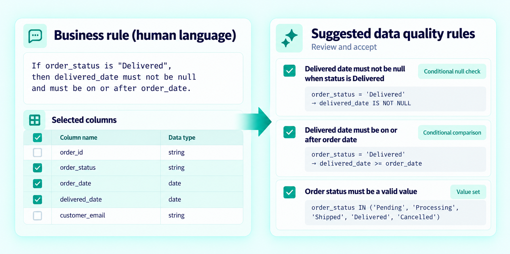
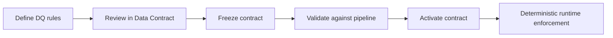

# Data Quality Rules

## The problem

Data Quality expectations often exist as business knowledge, profiling observations, or engineering logic. Without a common rule definition, those expectations are difficult to review, reuse, and enforce consistently across pipelines.

## The solution

FabricOps lets Governance define reviewable Data Quality rules as part of the Data Contract and lets Engineering enforce the approved rules in the pipeline.

Rules can be authored directly from supported rule types or, when AI is configured, generated as suggestions from plain-language business requirements. AI helps with authoring; the resulting rules and runtime enforcement remain explicit and deterministic.

## Define Data Quality rules

FabricOps provides reusable rule patterns for common Data Quality expectations, including:

- **Completeness** — control how much missing data is allowed.
- **Allowed values** — restrict a column to an approved set of values.
- **Blocked values** — reject known invalid values.
- **Range** — enforce numeric or comparable lower and upper bounds.
- **Uniqueness** — require a column to meet a distinctness threshold.
- **Column relationships and conditional rules** — validate expectations involving multiple columns.
- **Custom PySpark expressions** — cover requirements that cannot be represented faithfully by a standard rule.

Rules are stored in the Data Contract so they can be reviewed, frozen, validated, and enforced consistently.

## AI-assisted rule authoring

Business requirements are often written for people rather than validation engines. When AI assistance is enabled, Governance can describe a requirement in plain language and FabricOps translates it into the smallest set of supported Data Quality rules it can resolve.

For example, a requirement such as `Every completed order must have a shipped date` can be translated into a conditional completeness rule using the relevant columns.

The generated rules are suggestions, not a separate enforcement mechanism. They enter the same draft rule collection as rules authored manually and are reviewed before the Data Contract is frozen.

## How enforcement works

At runtime, FabricOps evaluates the approved rule definitions against the pipeline data. A rule can report a failure or stop the governed pipeline when it is configured to block on failure.

AI is not required at runtime. The pipeline enforces the explicit rules stored in the activated Data Contract.

## Go deeper

For the hands-on workflow, see [Step 3: Author and freeze the Data Contract](../guided-demo/03-author-and-freeze-data-contract.md).
