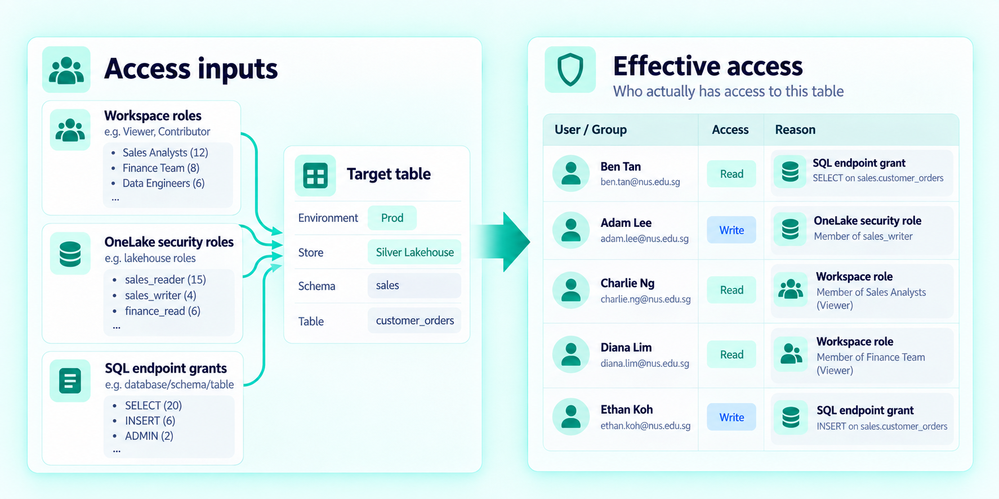
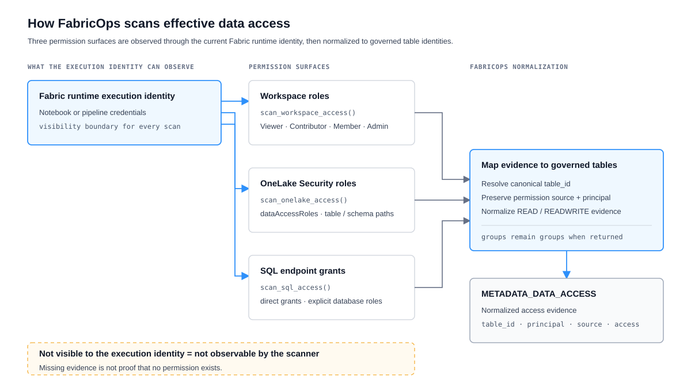
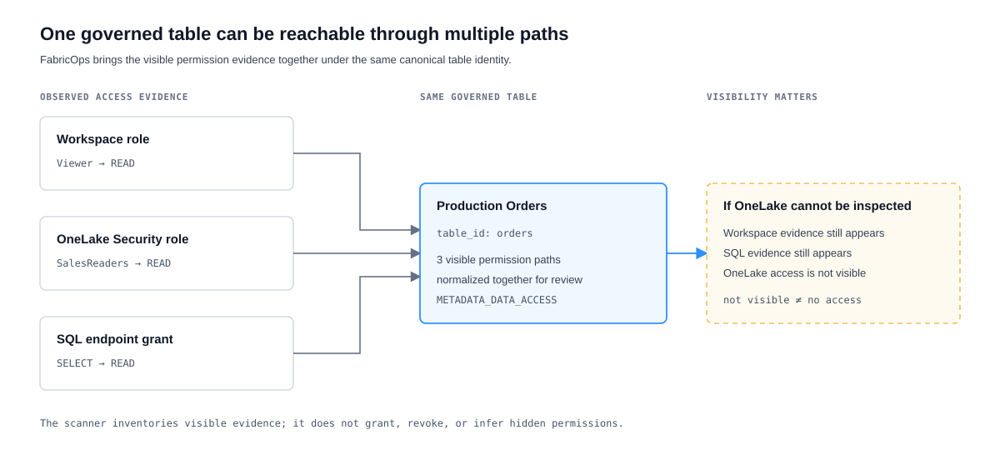

# Scan Effective Data Access

Preview

## The problem

Access to governed data in Microsoft Fabric is not represented by one permission list. A person or group can receive access through the workspace, through OneLake Security, or through the SQL analytics endpoint.

Looking at only one surface can therefore give Governance an incomplete picture of who can reach a governed table.

## The solution

FabricOps scans the three supported permission paths and maps the observations back to governed table identities:

1. **Workspace roles** — access inherited from Fabric workspace roles.
2. **OneLake Security roles** — access granted through OneLake data access roles for Lakehouse targets.
3. **SQL endpoint grants** — direct SQL permissions and permissions inherited through explicit database roles.

The result is normalized access evidence in `METADATA_DATA_ACCESS`, so Governance can review the supported access paths together.

!!! important "A scan is only as complete as the execution identity can see"
    FabricOps uses the credentials available to the notebook or pipeline that runs the scan. If that execution identity cannot inspect a permission surface, FabricOps cannot report permissions hidden behind it. **A missing access row is not proof that no access exists.**

## How it works

| Permission path | FabricOps observes | Result |
| --- | --- | --- |
| **Workspace roles** | Fabric workspace role assignments | Viewer → `READ`; Admin, Member, Contributor → `READWRITE` across active governed tables in the workspace. |
| **OneLake Security roles** | `dataAccessRoles` for configured Lakehouses | Supported table and schema paths map back to governed `table_id` values. |
| **SQL endpoint grants** | SQL permission catalogue views | Direct and explicit database-role permissions map to governed tables in scope. |

Groups remain groups where the underlying permission surface returns them. FabricOps does not expand group membership through Microsoft Graph.

## Under the hood

<strong>How the three access scanners are combined</strong>

Each scanner reads only its own permission surface:

- `scan_workspace_access()` reads workspace role assignments.
- `scan_onelake_access()` reads OneLake `dataAccessRoles`.
- `scan_sql_access()` reads SQL permission catalogue views through the read-only SQL endpoint connector.

FabricOps then resolves the observations to canonical `table_id` values and preserves the permission source, principal, and normalized access level in `METADATA_DATA_ACCESS`.

The scanners use the authentication available to the current Fabric runtime. They do not run with a separate privileged governance identity, so two executions can observe different evidence when their execution identities have different visibility.

The scanners are read-only with respect to permissions: they inventory access but do not grant, revoke, or change it.

## Example

??? example "Example: one governed table, multiple access paths"

    

    The key distinction is **unobserved versus no access**. If the execution identity can inspect Workspace and SQL permissions but cannot inspect OneLake Security, FabricOps records the visible Workspace and SQL evidence. It does not treat the missing OneLake observation as proof that no OneLake access exists.

## Go deeper

For exact scanner behaviour, inputs, outputs, and failure conditions, see:

- [`scan_workspace_access()`](../api/reference/scan_workspace_access.md)
- [`scan_onelake_access()`](../api/reference/scan_onelake_access.md)
- [`scan_sql_access()`](../api/reference/scan_sql_access.md)
- [`METADATA_DATA_ACCESS`](../reference/metadata/metadata_data_access.md)

For the wider Governance and Engineering model, see [How FabricOps Works](../how-fabricops-works.md).
