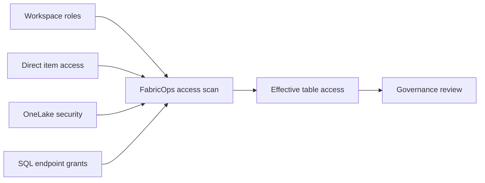

# Scan Effective Data Access

## The problem

Data access in Microsoft Fabric can be granted through several overlapping paths. Inspecting each permission mechanism separately makes it difficult for Governance to answer the question that matters: who can actually reach which governed tables?

## The solution

Resolve who actually has access to your tables by scanning workspace roles, direct item access, OneLake security roles, and SQL endpoint grants.

FabricOps scans those paths together so Governance can reason about the effective table access a user actually receives rather than inspecting each permission mechanism in isolation.

## How it works

## Implementation details

The useful question is not only which permissions exist. It is who can reach which governed tables after all applicable access paths are combined.

A future screen recording will show the scanner resolving effective access across the supported Fabric permission paths.

## Go deeper

For the wider Governance and Engineering model, see [How FabricOps Works](../how-fabricops-works.md).
