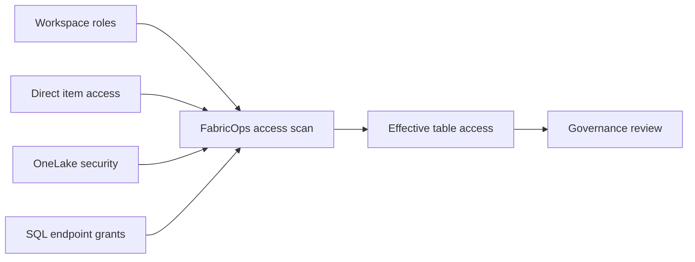

# Scan Effective Data Access

## The problem

Data access in Microsoft Fabric can be granted through several overlapping paths. Inspecting each permission mechanism separately makes it difficult for Governance to answer the question that matters: who can actually reach which governed tables?

## The solution

Resolve who actually has access to your tables by scanning workspace roles, direct item access, OneLake security roles, and SQL endpoint grants.

FabricOps scans those paths together so Governance can reason about the effective table access a user actually receives rather than inspecting each permission mechanism in isolation.

!!! important "Scanner visibility follows the execution identity"
    FabricOps calls the Microsoft Fabric APIs with the token available to the notebook or pipeline execution identity. The scanner can therefore report only permission information that identity is authorized to read. A missing access row must not be interpreted as proof that no access exists when a permission surface could not be observed.

## How it works

## Implementation details

The useful question is not only which permissions exist. It is who can reach which governed tables after all applicable access paths are combined. Scanner results must be interpreted together with scan visibility: complete API visibility supports a complete observation, while restricted API visibility can produce only a partial observation.

The same rule applies to **Scheduled Refresh** metadata shown during Data Contract authoring. FabricOps discovers the notebook schedule through the Microsoft Fabric API using the current execution identity. If that identity cannot read the schedule, FabricOps reports Scheduled Refresh as unavailable. **Unavailable does not mean that no schedule exists.**

A future screen recording will show the scanner resolving effective access across the supported Fabric permission paths.

## Go deeper

For the wider Governance and Engineering model, see [How FabricOps Works](../how-fabricops-works.md).
