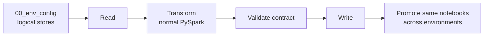
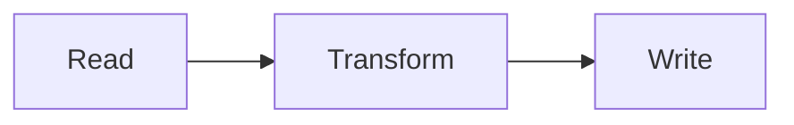
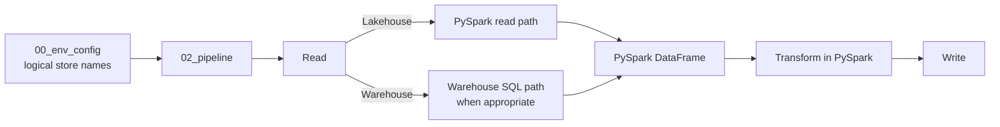

# Plug-and-Play, Environment-aware Data Pipelines

## The problem

Fabric notebooks work naturally against a single attached Lakehouse or Warehouse. Real ETL pipelines often cross multiple stores and environments, which can leave notebooks full of workspace IDs, item IDs, ABFSS paths, SQL endpoints, and environment-specific wiring that has to be changed during promotion.

## The solution

Clone the notebook stack, resolve environment-specific parameters through configuration, and promote the same notebooks from Development to Production.

FabricOps separates reusable pipeline logic from environment-specific Fabric identities and settings. The engineering notebook stack provides a repeatable pattern for environment setup, pipeline execution, Data Contract validation, and Production promotion. Standard Read and Write blocks handle the common Fabric plumbing while project-specific transformation remains normal PySpark.

## How it works

## Implementation details

### How Engineering runs across Fabric stores

Fabric notebooks work very well when a notebook only needs its **single default attached Lakehouse or Warehouse**. You can browse that store naturally and work with its files or tables without repeatedly describing where the data lives.

The difficulty starts when the pipeline needs **two or more Fabric stores**, which is normal for ETL. One pipeline may read from a source Lakehouse, enrich from a Warehouse, and publish to another target store. Without another abstraction, the notebook starts accumulating workspace IDs, item IDs, ABFSS paths, SQL endpoints, or attachment-specific logic.

FabricOps uses [`00_env_config`](https://github.com/Voycepeh/FabricOps-Starter-Kit/blob/main/templates/notebooks/00_env_config.ipynb) to solve that wiring problem. Each Fabric store gets a stable logical name such as `source`, `unified`, or `product`. `02_pipeline` refers to those logical names, while FabricOps resolves the physical resource for the current environment.

`02_pipeline` is deliberately a **full-read pipeline template**. Each governed source is read and canonically profiled as the complete persisted table on every run rather than as an incremental source batch. The target can still use its governed write strategy such as append, overwrite, partition overwrite, SCD1, or SCD2; full-read describes the source-processing model, not the target write mode.

`02B_incremental_append_pipeline` is a focused **incremental read → append** variant of the canonical `02_pipeline`. The target is defined before its sources so `pipeline_read()` can resolve the watermark or changed partitions last committed for that exact source → target relationship. A first run bootstraps with the complete source only when the append target is new or empty; later no-new-data runs can skip publication explicitly. The variant mixes one incremental driving source with one full supporting source, applies Source Drift to both, and profiles only complete full sources or the complete persisted target. Separate `02C` and `02D` variants can own the SCD patterns instead of mixing write strategies into `02B`.

That lets the notebook itself stay deliberately simple:

FabricOps standardizes the repeatable plumbing around the Read and Write boundaries. The transformation in the middle stays yours.

The configuration layer also lets FabricOps choose the execution path that matches the underlying store. Lakehouse access naturally uses the PySpark path. Warehouse sources can use the Warehouse SQL path when source-side SQL is the better execution option. In both cases, the pipeline returns to a **PySpark DataFrame** for project transformation.

### Read

A Read block describes one source and calls [`pipeline_read()`](../api/reference/pipeline_read.md). FabricOps then resolves the configured store from `00_env_config`, the canonical `table_id`, the physical Fabric item, and the correct lower-level reader.

Each Read block is designed to be **fully clonable**. Copy the whole block, change the small set of variables at the top such as the store, schema, table, or optional Warehouse query, and the same structure works for the next source.

After the source is read, the Read block keeps the governed checks and profiling explicit:

- enforce Freshness with [`check_freshness()`](../api/reference/check_freshness.md)
- enforce Schema on the returned DataFrame with [`check_schema()`](../api/reference/check_schema.md)
- enforce Data Quality on that same DataFrame with [`check_dq()`](../api/reference/check_dq.md)
- canonically profile the complete persisted source with [`profile_table()`](../api/reference/profile_table.md) using its `table_id`
- if [`check_dq()`](../api/reference/check_dq.md) returns a caller-owned DQ failure DataFrame, optionally persist it with [`write_lakehouse_table()`](../api/reference/write_lakehouse_table.md) or [`write_warehouse_table()`](../api/reference/write_warehouse_table.md)

The routing stays hidden underneath the public functions. [`pipeline_read()`](../api/reference/pipeline_read.md) dispatches governed table reads to [`read_lakehouse_table()`](../api/reference/read_lakehouse_table.md), [`read_warehouse_table()`](../api/reference/read_warehouse_table.md), or [`read_warehouse_query()`](../api/reference/read_warehouse_query.md) according to the resolved store and source definition. Raw Lakehouse files continue to use the foundational file readers directly.

A normal governed source therefore follows one canonical path in `02_pipeline`: read the complete source, run the source Guardrails, and refresh the complete physical table Profile. A filtered, joined, or aggregated Warehouse query may still be used as derived project data, but it does not replace the canonical Profile of the complete governed source table.

For a Lakehouse table, PySpark is the natural execution path. For a Warehouse, project-owned SQL can be pushed down through `query=...` so filtering, aggregation, projection, or other source-side work happens in the Warehouse before the result enters the Spark workflow. That avoids unnecessarily translating more Warehouse data into Spark than the pipeline needs.

### Transform

Once the Read blocks return Spark DataFrames, FabricOps gets out of the way. **Project transformations are ordinary PySpark DataFrame transformations.**

Join, filter, aggregate, derive columns, reshape data, or apply whatever business logic the project requires. This keeps the transformation readable to engineers instead of hiding it inside a framework-specific DSL.

That also means engineers can use **Microsoft Fabric Copilot** to help write or refine PySpark transformation code while the FabricOps Read and Write boundaries stay standardized.

### Write

A Write block publishes the prepared DataFrame through [`pipeline_write()`](../api/reference/pipeline_write.md). Like the Read block, it is designed to be **fully clonable**: copy the complete block, change the target variables at the top, and reuse the same governed publication structure for another target.

The target identity is resolved with [`resolve_table_id()`](../api/reference/resolve_table_id.md). The Write block is where the Data Contract becomes operational: FabricOps resolves the selected or active Data Contract and uses its governed processing definition to determine how the target is published.

The surrounding Write block keeps the important target decisions explicit and in sequence:

- enforce target Schema with [`check_schema()`](../api/reference/check_schema.md)
- enforce Sensitive Data Guardrails with [`check_sensitive_data()`](../api/reference/check_sensitive_data.md), then carry its returned DataFrame into every later step; when tokenization returns a caller-owned `support_mapping` DataFrame, optionally persist that mapping as project-owned support data
- enforce Source Drift with [`check_source_drift()`](../api/reference/check_source_drift.md) once the governed source-to-target relationship is known; the source's governed processing defines allowed changes, while the target identity selects its last-successful Source Observation baseline
- enforce target Data Quality on the Sensitive Data output with [`check_dq()`](../api/reference/check_dq.md)
- if [`check_dq()`](../api/reference/check_dq.md) returns a caller-owned DQ failure DataFrame, optionally persist it with [`write_lakehouse_table()`](../api/reference/write_lakehouse_table.md) or [`write_warehouse_table()`](../api/reference/write_warehouse_table.md)
- verify the governed target has the required Guardrail coverage with `check_guardrail_coverage()` before publication
- publish the prepared DataFrame with [`pipeline_write()`](../api/reference/pipeline_write.md), which resolves the governed load strategy and the correct Lakehouse or Warehouse path, adds FabricOps technical audit columns, persists the resolved load strategy and parameters in Catalogue, and commits successful Lineage plus lightweight Source Observation state only after the physical write succeeds
- profile the complete persisted target with an explicit post-write [`profile_table()`](../api/reference/profile_table.md) call, because append, partition overwrite, SCD1, and SCD2 results can differ from the input batch

This gives `02_pipeline` a consistent shape without turning it into a black box: **configure stores once in `00_env_config`, clone the Read and Write blocks, change the variables, and keep the project transformation in the middle as normal PySpark.**

??? info "Read more: how FabricOps routes work across Lakehouse and Warehouse"

    FabricOps public functions give the notebook stable interfaces while resolving the correct Lakehouse or Warehouse implementation underneath.

    [`pipeline_read()`](../api/reference/pipeline_read.md) routes governed table reads to the Lakehouse table, Warehouse table, or Warehouse query implementation. Raw Lakehouse files remain explicit file reads through the foundational file readers.

    [`profile_table()`](../api/reference/profile_table.md) uses Spark for a supplied DataFrame or Lakehouse table, and can use Warehouse-native SQL when profiling a physical Warehouse table.

    [`pipeline_write()`](../api/reference/pipeline_write.md) resolves the governed target and routes publication through the correct Lakehouse or Warehouse path while applying the Data Contract load strategy.

### Why it matters

Projects can reuse the same engineering pattern instead of rebuilding environment wiring, Fabric item resolution, validation, and publication behavior for every pipeline.

A future screen recording will show the same notebook pattern moving across environments without rewriting pipeline logic.

## Go deeper

For the hands-on workflow, start with the [Guided Demo](../guided-demo.md).
