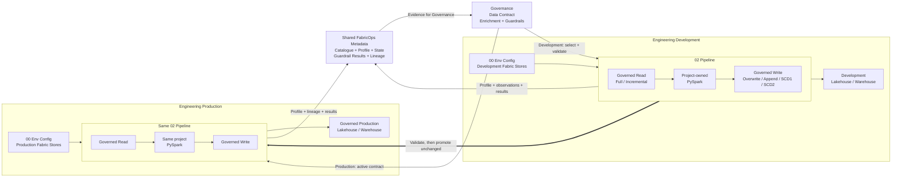
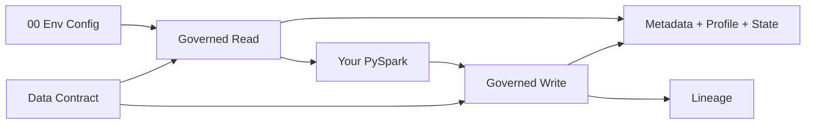

# Plug-and-Play Data Pipelines with Data Contract Enforcement

## The problem

A production data pipeline needs more than ETL. Engineers also need consistent environment handling, governed reads and writes, validation, metadata, profiling, lineage, and Data Contract enforcement.

That repeatable plumbing should not have to be rebuilt for every project, and it should not hide the project-specific transformation logic that engineers still need to own.

## The solution

FabricOps provides a **clonable two-notebook engineering stack**:

- [`00_env_config.ipynb`](https://github.com/Voycepeh/FabricOps-Starter-Kit/blob/main/templates/notebooks/00_env_config.ipynb) maps logical Fabric Stores to the correct environment-specific Fabric locations.
- [`02_pipeline.ipynb`](https://github.com/Voycepeh/FabricOps-Starter-Kit/blob/main/templates/notebooks/02_pipeline.ipynb) keeps the pipeline definition portable between environments, with governed Read and Write boundaries around ordinary project-owned PySpark.

The result is a pipeline pattern that engineers can clone and adapt without rebuilding the governance and engineering plumbing each time.

### The big picture

The picture has four important parts working together:

1. **Environment-aware configuration.** Each environment has its own `00_env_config`, which resolves the logical Fabric Stores to the correct Development or Production locations.
2. **A portable pipeline.** `02_pipeline` keeps the same governed shape: **Read → project-owned PySpark → Write**. The engineer changes the project logic, not the surrounding operating pattern.
3. **Executable governance.** Governance defines the Data Contract and Guardrails. Engineering selects and validates that contract in Development; after approval, Production resolves the active contract and enforces it through the same pipeline boundaries.
4. **A shared evidence layer.** Reads and writes continuously produce the Catalogue, profiles, processing state, Guardrail results, and lineage that connect the physical pipeline back to Governance.

Once the Development implementation and Data Contract agree, the validated `02_pipeline` is promoted unchanged. Production uses its own environment configuration and the active contract, so the same engineering definition runs against Production Fabric Stores without embedding environment-specific locations in the pipeline.

This is the core FabricOps pipeline model: **the engineer owns the transformation; Governance owns the governed definition; FabricOps makes the surrounding lifecycle repeatable and executable across environments.**

## How it works

### What the engineer configures

- The logical sources and targets used by the pipeline.
- How each source is read and each target is written.
- The project-specific PySpark transformation.
- The Data Contract context for governed tables.

### What AI can support

AI is optional. Microsoft Fabric Copilot or another coding agent can help write or refactor the project-specific PySpark, but AI is not part of pipeline execution or enforcement.

### What FabricOps handles deterministically

- Resolving environment-specific Fabric locations.
- Running governed Read and Write orchestration.
- Applying the selected Data Contract and executable Guardrails.
- Capturing the metadata, profiling, lineage, and processing state needed by the governed lifecycle.

## Under the hood

FabricOps deliberately leaves project logic visible while standardising the boundaries around it.

The orchestrators provide the stable framework boundary. Lower-level implementation details such as Full versus Incremental reads, load strategies, validation behaviour, and deployment are documented separately so this page can stay focused on the overall solution.

## Example

??? example "Orders + Products → Curated Orders"

    A project can read an Orders source and a Products reference table through governed Read boundaries, join and transform them using ordinary PySpark, then publish a Curated Orders table through a governed Write boundary.

    The engineer owns the transformation. FabricOps handles the repeatable environment, governance, metadata, and enforcement plumbing around it.

    See [Guided Demo Step 2: Build and run the ETL](../guided-demo/02-build-and-run-etl.md) for the working pipeline example.

## Go deeper

Use [How FabricOps Works](../how-fabricops-works.md) for the wider Governance and Engineering lifecycle.

For implementation details:

- [Read & Write Modes](../reference/read-and-load-strategies.md) — Full and Incremental reads, Overwrite, Append, SCD1, SCD2, and processing semantics.
- [PySpark Transformation](../reference/pyspark-transformation.md) — project-owned transformation patterns and performance guidance.
- [Guided Demo Step 2](../guided-demo/02-build-and-run-etl.md) — build and run the canonical pipeline.
- [Guided Demo Step 4](../guided-demo/04-validate-frozen-data-contract.md) — validate the frozen Data Contract against the pipeline.
- [Guided Demo Step 5](../guided-demo/05-activate-data-contract-and-promote.md) — activate the contract and promote the pipeline to Production.
- [Function Reference](../reference/index.md) — lower-level FabricOps APIs and orchestrators.
