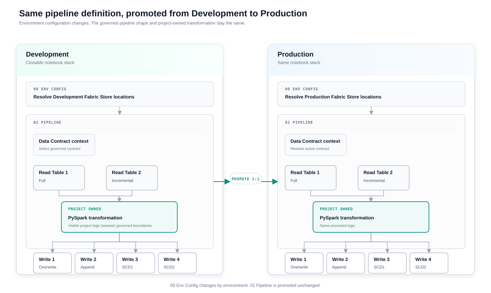
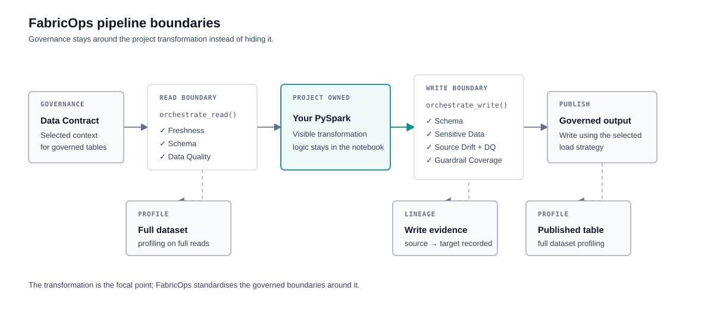

# Plug-and-Play Data Pipelines with Data Contract Enforcement

Preview

{ .fabricops-solution-hero }

## The problem

Building a governed data pipeline involves much more than reading a table, transforming a DataFrame, and writing the result. Engineers also need to handle environment resolution, incremental processing, load strategies, metadata, profiling, Data Contracts, Guardrails, validation, lineage, and the differences between Fabric Lakehouses and Warehouses.

A new engineer should not need to understand or rebuild all of that governance and engineering plumbing before they can create a reliable pipeline. At the same time, the framework should not hide so much that nobody can understand what the pipeline is doing.

FabricOps abstracts the repeatable plumbing behind a small, readable notebook interface: **choose how each source is read, write the project transformation in normal PySpark, choose how each target is written, and let FabricOps apply the governed lifecycle around it.**

## The solution

FabricOps provides a **clonable two-notebook engineering stack**:

- [`00_env_config.ipynb`](https://github.com/Voycepeh/FabricOps-Starter-Kit/blob/main/templates/notebooks/00_env_config.ipynb) maps logical Fabric Stores to the correct environment-specific Fabric locations.
- [`02_pipeline.ipynb`](https://github.com/Voycepeh/FabricOps-Starter-Kit/blob/main/templates/notebooks/02_pipeline.ipynb) keeps the pipeline definition portable between environments, with governed Read and Write boundaries around ordinary project-owned PySpark.

The result is a pipeline pattern that engineers can clone and adapt without rebuilding the governance and engineering plumbing each time.

### The big picture

{ .fabricops-solution-diagram }

The same two-notebook pattern moves from Development to Production. Each environment resolves its own Fabric Store locations through `00_env_config`, while the validated `02_pipeline` keeps the same governed shape: **Data Contract context → Full or Incremental reads → project-owned PySpark → Overwrite, Append, SCD1, or SCD2 writes**.

Once the Development implementation and Data Contract agree, the validated `02_pipeline` is promoted unchanged. Production uses its own environment configuration and the active contract, so the same engineering definition runs against Production Fabric Stores without embedding environment-specific locations in the pipeline.

This is the core FabricOps pipeline model: **the engineer owns the transformation; Governance owns the governed definition; FabricOps makes the surrounding lifecycle repeatable and executable across environments.**

## How it works

| Responsibility | What happens |
| --- | --- |
| **Engineer configures** | Chooses logical sources and targets, Read and Write modes, the project-specific PySpark transformation, and the Data Contract context for governed tables. |
| **AI can support** | Microsoft Fabric Copilot or another coding agent can help write or refactor project-specific PySpark. AI is optional and is not part of pipeline execution or enforcement. |
| **FabricOps handles deterministically** | Resolves environment-specific Fabric locations, runs governed Read and Write orchestration, applies the selected Data Contract and Guardrails, and records metadata, profiling, lineage, and processing state. |

## Under the hood

<strong>What happens in a standard FabricOps Pipeline</strong>

{ .fabricops-solution-diagram }

The Read boundary resolves the governed table and runs Freshness, Schema, and DQ checks before the DataFrame reaches the project-owned PySpark transformation. Full reads also produce full dataset profiling as part of the Read orchestration without making Profile another inline guardrail stage. The Write boundary applies pre-publication guardrails before writing, then performs full dataset profiling on the published table and records lineage.

The orchestrators provide the stable framework boundary. Read modes, Write modes, validation behaviour, and deployment are documented separately so this page can stay focused on the overall solution.

## Example

<strong>Orders + Products → Curated Orders</strong>

A project can read an Orders source and a Products reference table through governed Read boundaries, join and transform them using ordinary PySpark, then publish a Curated Orders table through a governed Write boundary.

The engineer owns the transformation. FabricOps handles the repeatable environment, governance, metadata, and enforcement plumbing around it.

See [Guided Demo Step 2: Build and run the ETL](../guided-demo/02-build-and-run-etl.md) for the working pipeline example.

## Go deeper

Use [How FabricOps Works](../how-fabricops-works.md) for the wider Governance and Engineering lifecycle.

For implementation details:

- [Read & Write Modes](../reference/read-and-load-strategies.md) — Full and Incremental reads, Overwrite, Append, SCD1, SCD2, and processing semantics.
- [PySpark Transformation](../reference/pyspark-transformation.md) — project-owned transformation patterns and performance guidance.
- [Guided Demo Step 2](../guided-demo/02-build-and-run-etl.md) — build and run the canonical pipeline.
- [Guided Demo Step 4](../guided-demo/04-validate-frozen-data-contract.md) — validate the frozen Data Contract against the pipeline.
- [Guided Demo Step 5](../guided-demo/05-activate-data-contract-and-promote.md) — activate the contract and promote the pipeline to Production.
- [Function Reference](../reference/index.md) — lower-level FabricOps APIs and orchestrators.
