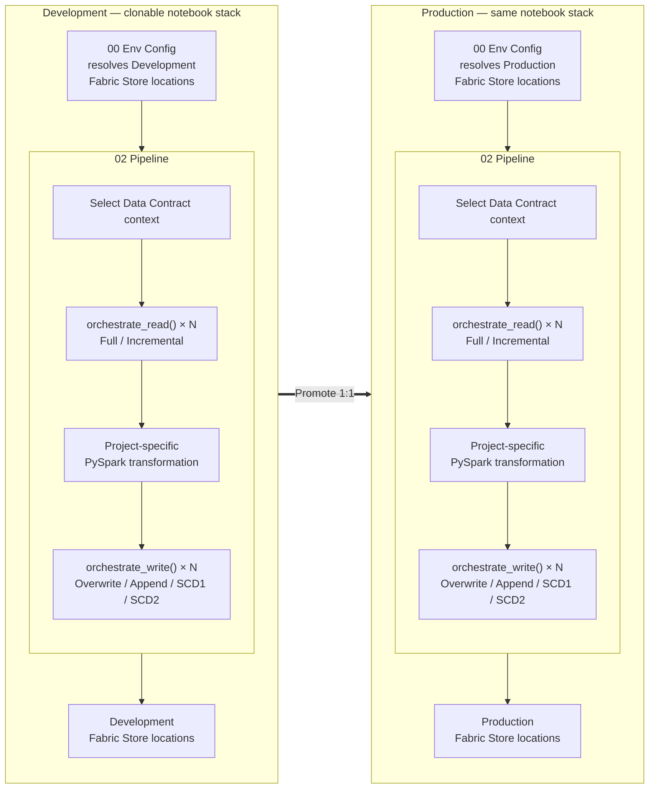
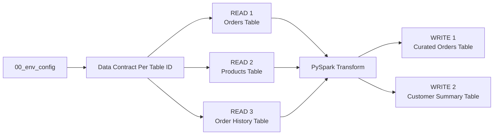
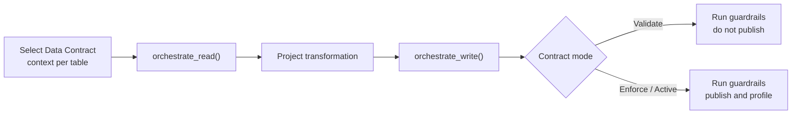
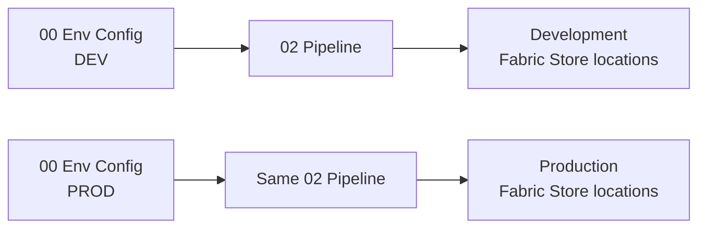

# Plug-and-Play Data Pipelines with Data Contract Enforcement


## The problem

Building a governed data pipeline involves much more than reading a table, transforming a DataFrame, and writing the result. Engineers also need to handle environment resolution, incremental processing, load strategies, metadata, profiling, Data Contracts, Guardrails, validation, lineage, and the differences between Fabric Lakehouses and Warehouses.

A new engineer should not need to understand or rebuild all of that governance and engineering plumbing before they can create a reliable pipeline. At the same time, the framework should not hide so much that nobody can understand what the pipeline is doing.

FabricOps abstracts the repeatable plumbing behind a small, readable notebook interface: **choose how each source is read, write the project transformation in normal PySpark, choose how each target is written, and let FabricOps apply the governed lifecycle around it.**

## The solution

FabricOps provides a **clonable two-notebook engineering stack**:

- [`00_env_config.ipynb`](https://github.com/Voycepeh/FabricOps-Starter-Kit/blob/main/templates/notebooks/00_env_config.ipynb) maps the logical Fabric Stores used by the pipeline to their environment-specific Fabric locations.
- [`02_pipeline.ipynb`](https://github.com/Voycepeh/FabricOps-Starter-Kit/blob/main/templates/notebooks/02_pipeline.ipynb) is the pipeline you promote unchanged between environments. It provides two plug-and-play governed ETL boundaries: [`orchestrate_read()`](../api/reference/orchestrate_read.md) and [`orchestrate_write()`](../api/reference/orchestrate_write.md).

Everything project-specific stays visible between those boundaries as ordinary PySpark transformation code.

## The big picture



The same notebook stack exists in Development and Production. `00_env_config` maps the logical Fabric Stores used by the pipeline to their environment-specific Fabric locations, while `02_pipeline` is promoted unchanged from Development to Production. Inside each pipeline, Data Contract context is selected before the governed ETL flow. A pipeline can use multiple `orchestrate_read()` calls, each choosing Full or Incremental, transform the resulting DataFrames with project-owned PySpark, and use multiple `orchestrate_write()` calls, each independently choosing Overwrite, Append, SCD1, or SCD2.

## Read modes

Each source independently chooses its Read mode through `orchestrate_read()`. The same canonical `02_pipeline` can mix Full and Incremental reads.

| Read mode | Setting | Typical intent |
| --- | --- | --- |
| Full | `read_mode="full"` | Read the complete source table |
| Incremental | `read_mode="incremental"` | Read only the source data required for the next processing window |

For example, one pipeline can use an Incremental read for a high-volume Orders table and a Full read for a smaller Products reference table. Each source has its own `orchestrate_read()` call, so the choice is per source rather than a pipeline-wide setting.

## Transform in the notebook

Transformation belongs to the project. FabricOps returns PySpark DataFrames from the Read orchestrators, and the engineer writes the joins, filters, derivations, aggregations, reshaping, and other project-specific PySpark needed between Read and Write.

FabricOps deliberately does not introduce a transformation DSL or hide this logic behind the framework. For practical examples, use the [FabricOps PySpark transformation cheat sheet](../reference/engineering-cheat-sheet.md#pyspark-transformation-cheat-sheet). For the broader platform guidance, use [Microsoft Learn: Apache Spark in Microsoft Fabric](https://learn.microsoft.com/en-us/fabric/data-engineering/spark-compute) and [Microsoft Learn: Fabric Data Engineering](https://learn.microsoft.com/en-us/fabric/data-engineering/).

In day-to-day development, you can also use Microsoft Fabric Copilot or another AI coding agent to help write the project-specific PySpark. The transformation remains ordinary PySpark owned by the project; FabricOps focuses on the governed Read and Write boundaries around it.

## Write modes

Each target independently chooses its Write mode through `orchestrate_write()`. The same canonical `02_pipeline` can mix Overwrite, Append, SCD1, and SCD2 writes.

| Write mode | Setting | Typical intent |
| --- | --- | --- |
| Overwrite | `load_strategy="overwrite"` | Publish the complete target state |
| Append | `load_strategy="append"` | Append a new batch |
| SCD1 | `load_strategy="scd1"` | Update matching business keys and insert new rows |
| SCD2 | `load_strategy="scd2"` | Maintain historical versions as records change |

Each target has its own `orchestrate_write()` call, so the choice is per target rather than a pipeline-wide setting.

The standard pipeline shape is:



See [Guided Demo Step 2: Build and run the ETL](../guided-demo/02-build-and-run-etl.md) to walk through this pipeline in the canonical `02_pipeline` notebook.

## Data Contract enforcement is wired into the same pipeline

The canonical `02_pipeline` selects Data Contract context before the ETL blocks. Contract mode is resolved **per table**, so different governed tables in the same notebook can be at different lifecycle stages.



Before an applicable Data Contract exists, the same standard notebook can bootstrap normally and contract-backed checks that do not apply are visibly skipped. Once a frozen contract is selected for validation, the same pre-publication guardrails run but the target is not published. Once the approved contract is activated for enforcement, the same notebook and orchestrators enforce it and continue through publication.

The important point is that governance is not a second pipeline implementation. **The Data Contract is wired into the same Read → Transform → Write workflow that Engineering already promotes.**

## Promotion

`00_env_config` owns the environment-specific resolution. `02_pipeline` owns the pipeline definition.

That separation means Engineering promotes the same `02_pipeline` from Development to Production while `00_env_config` maps logical Fabric Stores such as Bronze, Silver, Gold, and Metadata to their environment-specific Fabric locations.



## Why one canonical pipeline template

FabricOps does not need a separate notebook architecture for full refresh, incremental append, SCD1, SCD2, or combinations of them. Those are **modes selected through the orchestrators**.

The stable model is:

```text
00 Env Config
      ↓
02 Pipeline
  select Data Contract context
      ↓
  orchestrate_read(...)   ← one per source; full or incremental
      ↓
  project PySpark transformation
      ↓
  orchestrate_write(...)  ← one per target; overwrite / append / SCD1 / SCD2
```

This keeps the template easy to clone, the transformation easy to understand, promotion environment-aware, and the governed runtime behavior centralized in FabricOps rather than copied into every project notebook.

## Go deeper

Follow the [Guided Demo](../guided-demo.md) to build the pipeline step by step. Use the [Function Reference](../reference/index.md) when you need the lower-level capabilities behind the orchestrators.
