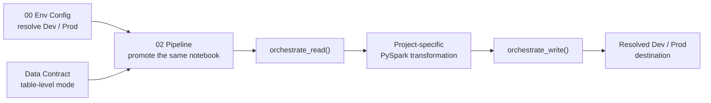
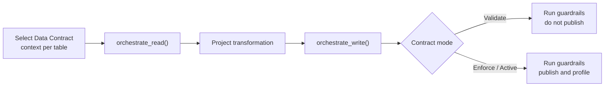
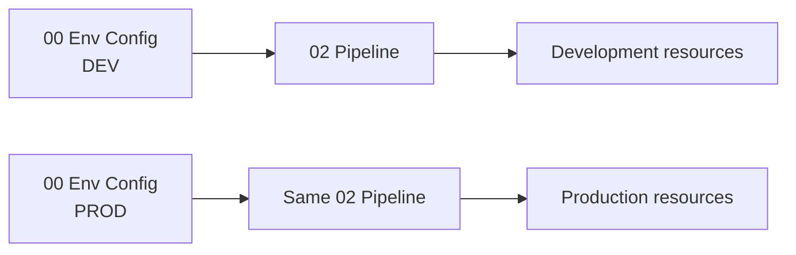

# Plug-and-Play Data Pipelines with Data Contract Enforcement


## The problem

Fabric pipelines often start simple, then accumulate environment-specific workspace IDs, item IDs, paths, SQL endpoints, repeated read/write plumbing, and governance logic. That makes the notebook harder to promote from Development to Production and harder to reuse across projects.

## The solution

FabricOps provides a **clonable two-notebook engineering stack**:

- [`00_env_config.ipynb`](https://github.com/Voycepeh/FabricOps-Starter-Kit/blob/main/templates/notebooks/00_env_config.ipynb) resolves the logical Fabric stores to the physical resources for the current Development or Production environment.
- [`02_pipeline.ipynb`](https://github.com/Voycepeh/FabricOps-Starter-Kit/blob/main/templates/notebooks/02_pipeline.ipynb) is the pipeline you promote unchanged between environments. It provides two plug-and-play governed ETL boundaries: [`orchestrate_read()`](../api/reference/orchestrate_read.md) and [`orchestrate_write()`](../api/reference/orchestrate_write.md).

Everything project-specific stays visible between those boundaries as ordinary PySpark transformation code.

## The big picture



The notebook structure stays the same. What changes from pipeline to pipeline are the arguments passed to each Read and Write orchestrator and the transformation code in the middle.

## Read recipes

Each source has its **own** `orchestrate_read()` call. Read strategy is therefore a per-table decision, not a setting for the whole pipeline.

A pipeline can, for example, incrementally read a high-volume Orders table while fully reading a smaller Products reference table:

```python
orders = orchestrate_read(
    name="orders",
    store="Bronze",
    schema="demo",
    table_name="orders",
    read_mode="incremental",
    target_table_id=target_table_id,
    spark_session=spark,
)

products = orchestrate_read(
    name="products",
    store="Bronze",
    schema="demo",
    table_name="products",
    read_mode="full",
    spark_session=spark,
)
```

The same governed boundary resolves the environment-aware source and runs the standard FabricOps Read lifecycle. The lower-level read, freshness, schema, data-quality, profiling, and routing capabilities remain behind the orchestrator. Advanced users can still compose those public capabilities directly when they genuinely need a custom lifecycle.

## Transform in the notebook

FabricOps deliberately does not hide project business logic behind a framework DSL. Once the sources return PySpark DataFrames, the middle of `02_pipeline` belongs to the project.

```python
orders_df = orders["dataframe"]
products_df = products["dataframe"]

transformed_df = (
    orders_df
    .join(products_df, "product_id")
    # project-specific filters, derivations, joins, aggregations...
)
```

This is also the natural place to use Microsoft Fabric Copilot or another coding assistant. FabricOps standardizes the governed boundaries while the transformation remains normal PySpark.

## Write recipes

Each target independently chooses its publication strategy through `orchestrate_write()`. The same canonical `02_pipeline` can therefore express the supported patterns without requiring a different notebook template for each one.

| Recipe | Orchestrator choice | Typical intent |
| --- | --- | --- |
| Replace target | `load_strategy="overwrite"` | Publish the complete target state |
| Add new rows | `load_strategy="append"` | Append a new batch |
| Merge current state | `load_strategy="scd1"` | Update matching business keys and insert new rows |
| Preserve history | `load_strategy="scd2"` | Maintain historical versions as records change |

For example:

```python
write_result = orchestrate_write(
    transformed_df,
    name="curated_orders",
    sources=[orders, products],
    store="Silver",
    schema="demo",
    table_name="curated_orders",
    load_strategy="scd1",
    contracts=CONTRACTS,
    spark_session=spark,
)
```

Read and Write choices are independent. One pipeline may mix full and incremental sources, then publish multiple targets using different supported write strategies.

## Data Contract enforcement is wired into the same pipeline

The canonical `02_pipeline` selects Data Contract context before the ETL blocks. Contract mode is resolved **per table**, so different governed tables in the same notebook can be at different lifecycle stages.



Before an applicable Data Contract exists, the same standard notebook can bootstrap normally and contract-backed checks that do not apply are visibly skipped. Once a frozen contract is selected for validation, the same pre-publication guardrails run but the target is not published. Once the approved contract is activated for enforcement, the same notebook and orchestrators enforce it and continue through publication.

The important point is that governance is not a second pipeline implementation. **The Data Contract is wired into the same Read → Transform → Write workflow that Engineering already promotes.**

## Promotion

`00_env_config` owns the environment-specific resolution. `02_pipeline` owns the pipeline definition.

That separation means Engineering promotes the same `02_pipeline` from Development to Production while `00_env_config` resolves logical stores such as Bronze, Silver, Gold, and Metadata to the correct physical Fabric resources for that environment.



## Why one canonical pipeline template

FabricOps does not need a separate notebook architecture for full refresh, incremental append, SCD1, SCD2, or combinations of them. Those are **recipes expressed through the orchestrators**.

The stable model is:

```text
00 Env Config
      ↓
02 Pipeline
  select Data Contract context
      ↓
  orchestrate_read(...)   ← one per source; full or incremental
      ↓
  project PySpark transformation
      ↓
  orchestrate_write(...)  ← one per target; overwrite / append / SCD1 / SCD2
```

This keeps the template easy to clone, the transformation easy to understand, promotion environment-aware, and the governed runtime behavior centralized in FabricOps rather than copied into every project notebook.

## Go deeper

Follow the [Guided Demo](../guided-demo.md) to build the pipeline step by step. Use the [Function Reference](../reference/index.md) when you need the lower-level capabilities behind the orchestrators.
