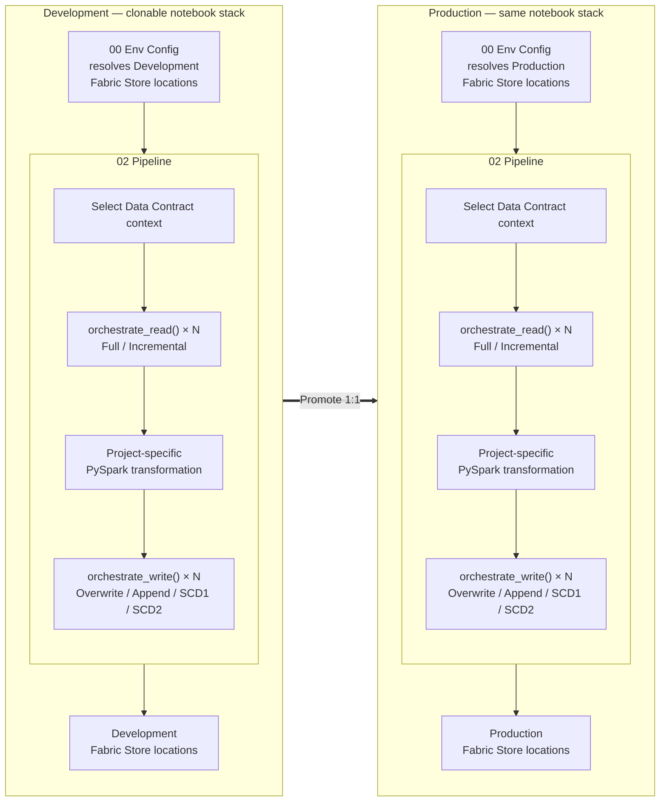
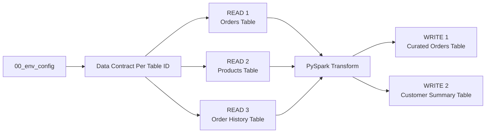
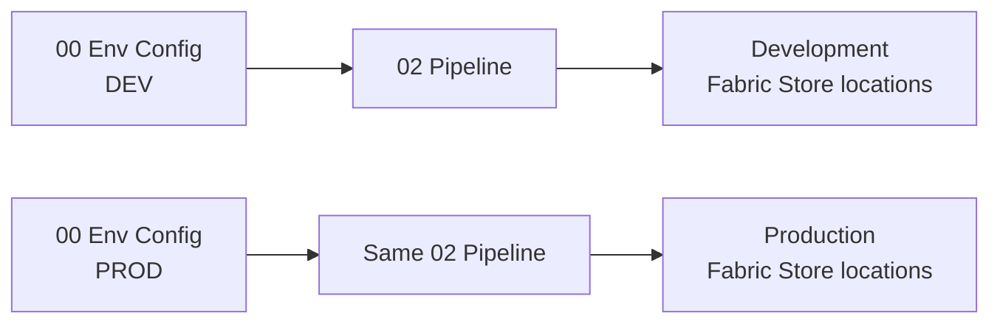

# Plug-and-Play Data Pipelines with Data Contract Enforcement

## The problem

Building a governed data pipeline involves much more than reading a table, transforming a DataFrame, and writing the result. Engineers also need to handle environment resolution, incremental processing, load strategies, metadata, profiling, Data Contracts, Guardrails, validation, lineage, and the differences between Fabric Lakehouses and Warehouses.

A new engineer should not need to understand or rebuild all of that governance and engineering plumbing before they can create a reliable pipeline. At the same time, the framework should not hide so much that nobody can understand what the pipeline is doing.

FabricOps abstracts the repeatable plumbing behind a small, readable notebook interface: **choose how each source is read, write the project transformation in normal PySpark, choose how each target is written, and let FabricOps apply the governed lifecycle around it.**

## The solution

FabricOps provides a **clonable two-notebook engineering stack**:

- [`00_env_config.ipynb`](https://github.com/Voycepeh/FabricOps-Starter-Kit/blob/main/templates/notebooks/00_env_config.ipynb) maps the logical Fabric Stores used by the pipeline to their environment-specific Fabric locations.
- [`02_pipeline.ipynb`](https://github.com/Voycepeh/FabricOps-Starter-Kit/blob/main/templates/notebooks/02_pipeline.ipynb) is the pipeline you promote unchanged between environments. It provides two plug-and-play governed ETL boundaries: [`orchestrate_read()`](../api/reference/orchestrate_read.md) and [`orchestrate_write()`](../api/reference/orchestrate_write.md).

Everything project-specific stays visible between those boundaries as ordinary PySpark transformation code.

## The big picture

The same notebook stack exists in Development and Production. `00_env_config` maps the logical Fabric Stores used by the pipeline to their environment-specific Fabric locations, while `02_pipeline` is promoted unchanged from Development to Production. Inside each pipeline, Data Contract context is selected before the governed ETL flow. A pipeline can use multiple `orchestrate_read()` calls, each choosing Full or Incremental, transform the resulting DataFrames with project-owned PySpark, and use multiple `orchestrate_write()` calls, each independently choosing Overwrite, Append, SCD1, or SCD2.

## Choose how each source is read

Each source has its own `orchestrate_read()` call, so one pipeline can mix different read behaviours. For example, a high-volume Orders source can be incremental while a smaller Products reference source is read in full.

The [Read & Write Modes reference](../reference/read-and-load-strategies.md) is the source of truth for supported Read modes, settings, required parameters, bootstrap behaviour, Source Observation, and incremental progress semantics.

## Transform in the notebook

Transformation belongs to the project. FabricOps returns PySpark DataFrames from the Read orchestrators, and the engineer writes the joins, filters, derivations, aggregations, reshaping, and other project-specific PySpark needed between Read and Write.

FabricOps deliberately does not introduce a transformation DSL or hide this logic behind the framework. Use the [PySpark Transformation Reference](../reference/pyspark-transformation.md) for common transformation patterns and optimization reminders. For broader platform guidance, use [Microsoft Learn: Apache Spark in Microsoft Fabric](https://learn.microsoft.com/en-us/fabric/data-engineering/spark-compute) and [Microsoft Learn: Fabric Data Engineering](https://learn.microsoft.com/en-us/fabric/data-engineering/).

In day-to-day development, you can also use Microsoft Fabric Copilot or another AI coding agent to help write the project-specific PySpark. The transformation remains ordinary PySpark owned by the project; FabricOps focuses on the governed Read and Write boundaries around it.

## Choose how each target is written

Each target has its own `orchestrate_write()` call, so write behaviour is selected per target rather than for the whole pipeline. A single pipeline can therefore publish different targets using different governed load strategies.

The [Read & Write Modes reference](../reference/read-and-load-strategies.md) is the source of truth for supported Write modes, settings, required parameters, SCD behaviour, examples, and incremental-write safety.

!!! warning "Multiple Write blocks are not atomic"
    Each `orchestrate_write()` publishes independently. If an earlier Write succeeds and a later Write fails, the pipeline is partially published. Rerunning the notebook executes the earlier Write again, which can duplicate or otherwise repeat non-idempotent writes such as Append. If partial publication or duplicate writes are unacceptable, use separate pipeline executions for each governed target.

The standard pipeline shape is:

See [Guided Demo Step 2: Build and run the ETL](../guided-demo/02-build-and-run-etl.md) to walk through this pipeline in the canonical `02_pipeline` notebook.

## Promotion

`00_env_config` owns the environment-specific resolution. `02_pipeline` owns the pipeline definition.

That separation means Engineering promotes the same `02_pipeline` from Development to Production while `00_env_config` maps logical Fabric Stores such as Bronze, Silver, Gold, and Metadata to their environment-specific Fabric locations.

See [Guided Demo Step 5: Activate the Data Contract and promote to Production](../guided-demo/05-activate-data-contract-and-promote.md) for the promotion walkthrough.

## Data Contract enforcement

Each governed table has a Data Contract selected at the start of `02_pipeline`. The Read and Write orchestrators use that table's contract to enforce the expectations that apply on the source or target side.

The purpose is to catch a pipeline that can **technically succeed but still produce the wrong data**.

A Data Contract brings together the governed table definition, descriptive Enrichment, executable Guardrails, and Processing expectations. See [How FabricOps Works](../how-fabricops-works.md) for how Data Contracts fit into the wider Governance and Engineering lifecycle, and [AI-Assisted Data Contract Authoring](ai-assisted-data-contract-authoring.md#what-the-data-contract-captures) for the detailed contract contents.

### How enforcement works

The orchestrators call the underlying FabricOps checks at the appropriate Read or Write boundary. Checks such as Schema, Freshness, Source Drift, Sensitive Data, Data Quality, and Guardrail Coverage can stop the pipeline when a blocking expectation fails. On the Write side, these checks run before `pipeline_write()`, so invalid data can fail early before writing to the target.

In Development, [Guided Demo Step 4: Validate the frozen Data Contract](../guided-demo/04-validate-frozen-data-contract.md) uses this same enforcement path to validate the frozen contract against the real pipeline without writing to the target. In [Step 5](../guided-demo/05-activate-data-contract-and-promote.md), Governance activates that validated contract for Production. When the promoted `02_pipeline` runs in Production, the activated contract is resolved and enforced; only after the blocking checks succeed does the Write path continue to `pipeline_write()` and write to the target.

## Go deeper

Follow the [Guided Demo](../guided-demo.md) to build the pipeline step by step. Use the [Function Reference](../reference/index.md) when you need the lower-level capabilities behind the orchestrators.
