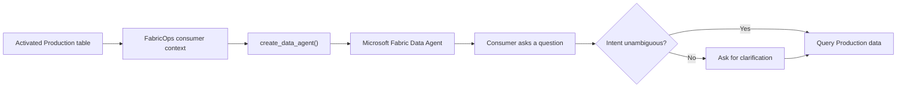

# Production Table to Data Agent

## The problem

A Production table can be technically ready for consumption while still requiring manual setup before a useful Data Agent can answer business questions well. Re-entering the table purpose, grain, terminology, column meaning, business rules, and known limitations duplicates context that FabricOps already governs.

## The solution

FabricOps bootstraps a Microsoft Fabric Data Agent directly from one activated Production table.

`create_data_agent()` resolves the active Production Data Contract, builds a deterministic consumer context, creates the native Fabric Data Agent, connects the governed Lakehouse or Warehouse table, and configures instructions from the context FabricOps already knows.

The Data Agent still queries the **actual Production data** through Microsoft Fabric. FabricOps adds the business context needed to interpret that data consistently; it does not copy the business data into the prompt or replace Fabric permissions.

## What FabricOps carries forward

FabricOps reuses governed context that is useful to a consumer rather than restating information the Data Agent can obtain from the data source itself:

- table purpose and grain;
- business terminology and column meaning;
- approved business rules and known limitations;
- classification and sensitivity context where recorded;
- ambiguity guidance derived from the available schema and governed descriptions.

This makes the activated Data Contract useful beyond pipeline enforcement: the same reviewed context helps bootstrap the consumption experience.

## Ask instead of guess

Some questions are ambiguous even when the underlying data is available.

For example, an orders table might contain `order_date`, `ship_date`, and `payment_date`. FabricOps can identify these as date/time fields and carry their governed descriptions into the Data Agent instructions. It does **not** invent a default business date.

If a user asks for "monthly orders" without identifying the intended date concept, the generated instructions tell the Data Agent to ask which date field the user means rather than silently choosing one.

The same principle applies more broadly when multiple fields could reasonably represent the user's intent: **use governed meaning when it is explicit; ask when it is genuinely ambiguous.**

## Consumption flow

<strong>Under the hood</strong>

FabricOps builds the consumer context deterministically from the activated Production contract and catalogue identity. The generated agent instructions define behavioural boundaries such as using governed business meaning, not inventing undocumented semantics, and asking when multiple plausible concepts remain.

Datasource instructions carry the table-specific context. Date/time fields are surfaced from the governed schema and their descriptions or business terms are included when available. Multiple plausible date/time fields trigger explicit clarification guidance rather than an inferred default.

`create_data_agent()` then uses the current Fabric notebook caller identity to call the Microsoft Fabric REST API, creates the Data Agent, attaches the single governed Production Lakehouse or Warehouse table, selects that table, and applies the generated datasource and agent instructions.

The MVP deliberately remains single-table. Multi-table relationship modelling, ontology authoring, duplicate-agent registration, evaluation, and automatic publication are outside this capability.

For the exact callable contract and implementation details, use the generated function references rather than this solution page.

## Go deeper

See [`create_data_agent()`](../api/reference/create_data_agent.md) for the public creation API, [`build_consumer_context()`](../api/reference/build_consumer_context.md) for context assembly, and [`render_data_agent_instructions()`](../api/reference/render_data_agent_instructions.md) for instruction generation.

For where this fits in the lifecycle, see [Step 7: Governed Consumption](../guided-demo/07-consume-production-data.md).
