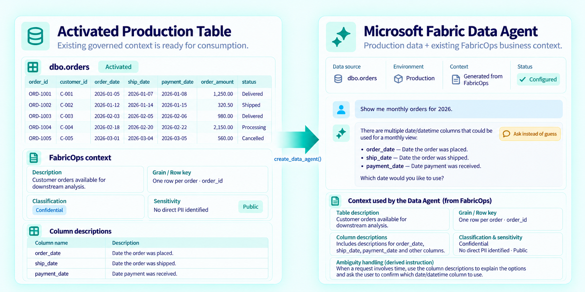
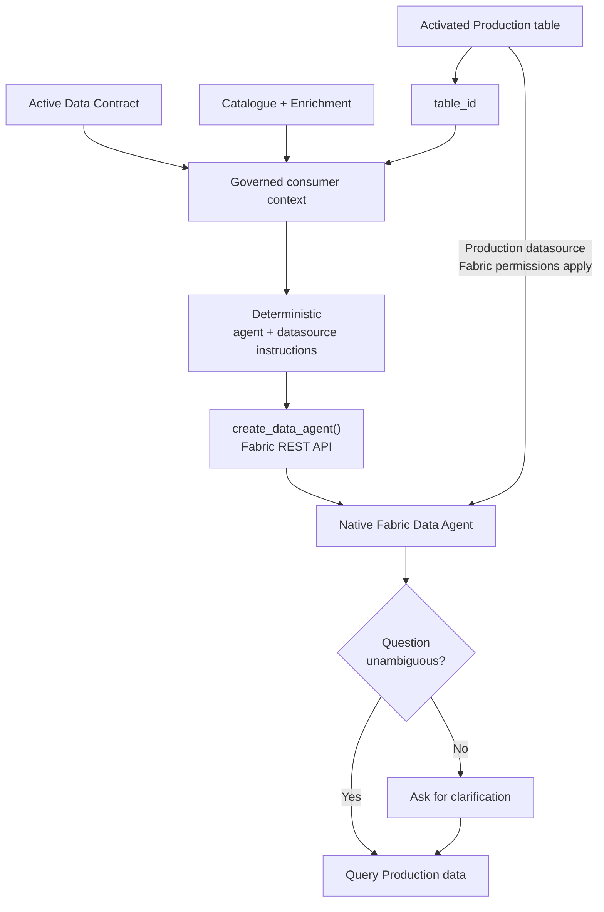

# Production Table to Data Agent

## The problem

Microsoft Fabric Data Agents can already work well out of the box, particularly with a single, well-structured table.

The harder cases are the business semantics that the data alone cannot reliably resolve. A table might contain `order_date`, `ship_date`, and `payment_date`; `gross_amount` and `net_amount`; or several similar customer identifiers. Every column may be valid, but choosing the wrong one can produce a technically correct query that answers the wrong business question.

To configure a Data Agent well, teams usually need to provide this business context manually. But by the time a table has gone through the previous six FabricOps lifecycle steps, much of that work has already been done: its purpose, grain, column meaning, business rules, sensitivity, limitations, and other governed context have already been captured.

That creates a natural opportunity: **reuse the context FabricOps already has to bootstrap a better-configured Data Agent instead of asking the team to describe the Production table again.**

## The solution

FabricOps reuses the governed context it already has: table purpose, grain, business terminology, column descriptions, approved business rules, known limitations, classification, sensitivity, and other Data Contract context.

FabricOps prepares the governed context of the Production table into Data Agent instructions, then uses the Microsoft Fabric API to create and configure the Data Agent with those instructions.

This means that at **Step 7, the final stage of the FabricOps lifecycle**, the governed Production table can be handed off as a ready-to-use Data Agent for consumption, reusing the context captured throughout the previous six steps.

**Governed Production Table + FabricOps Context → Data Agent Instructions → Fabric API → Data Agent ready for consumption**

The Data Agent still queries the **actual Production data** through Microsoft Fabric. FabricOps does not copy business-table rows into the prompt or replace Fabric permissions. It supplies business context that cannot always be inferred safely from the data alone.

!!! note "Work in progress"

    FabricOps currently provides `create_data_agent()`, which creates and configures a Data Agent from **one governed Production table**. In future iterations, we plan to extend this to support **multiple related governed tables within a Data Agent**.

## How it works

### What the human governs

The useful meaning is captured during the normal FabricOps lifecycle rather than authored again just for the Data Agent. This can include:

- Table purpose and grain.
- Business terminology and column descriptions.
- Approved business rules and known limitations.
- Classification and sensitivity decisions.

The human remains responsible for the governed meaning. FabricOps does not invent missing business definitions.

### What the Data Agent does

The native Microsoft Fabric Data Agent uses those instructions when interpreting consumer questions and queries the actual Production table through Fabric.

When the governed context makes the intended concept clear, the agent can use it. When multiple plausible concepts remain, the instructions tell the agent to ask rather than guess.

### What FabricOps does deterministically

FabricOps:

- Resolves the activated Production Data Contract and catalogue identity for the selected `table_id`.
- Selects the governed context useful to a consumer rather than dumping internal metadata or raw business data into instructions.
- Renders separate agent and datasource instructions.
- Creates and configures the native Fabric Data Agent through the Fabric REST API.
- Attaches the governed single Production Lakehouse or Warehouse table as its datasource.

Fabric permissions remain authoritative for access to the Production data and for creating the Data Agent.

## Under the hood

`create_data_agent()` uses the current Fabric notebook caller identity to call the Microsoft Fabric REST API. It creates the Data Agent, attaches the configured Production Lakehouse or Warehouse datasource, selects the governed table, and applies the generated datasource and agent instructions.

FabricOps does **not** copy the Production table into an AI prompt. The table remains a Fabric datasource and the caller's Fabric permissions continue to control access.

The API is currently **Preview** and the MVP remains single-table. Multi-table relationship authoring, duplicate-agent registration, evaluation, and automatic publication are outside this capability.

## Example

??? example "Ask instead of guess"

    An orders table might contain:

    | Field | Governed meaning |
    | --- | --- |
    | `order_date` | Date the order was placed |
    | `ship_date` | Date the order was shipped |
    | `payment_date` | Date payment was received |

    If a consumer asks **"Show me monthly orders for 2026"**, several interpretations are plausible.

    FabricOps does not invent a default business date. The generated context tells the Data Agent that these date concepts are distinct and that genuine ambiguity should be clarified.

    > **Consumer:** Show me monthly orders for 2026.
    >
    > **Data Agent:** There are multiple date fields that could be used for a monthly view: `order_date`, `ship_date`, and `payment_date`. Which date would you like to use?

    The same principle applies to gross versus net amounts, lifecycle statuses, or multiple customer and account identifiers: **use governed meaning when it is explicit; ask when it is genuinely ambiguous.**

## Go deeper

Use [Step 7: Governed Consumption](../guided-demo/07-consume-production-data.md) to see where the Data Agent handoff fits in the governed consumer lifecycle.

Use the generated [`create_data_agent()` reference](../api/reference/create_data_agent.md) for the exact Preview API contract, prerequisites, parameters, errors, and implementation details.
