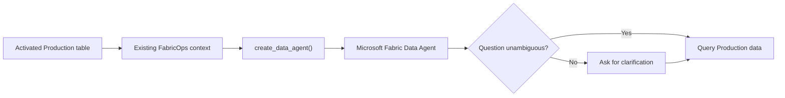

# Production Table to Data Agent

## The problem

Microsoft Fabric Data Agents can already work well out of the box, particularly with a single, well-structured table.

The harder cases are the business semantics that the data alone cannot reliably resolve. A table might contain `order_date`, `ship_date`, and `payment_date`; `gross_amount` and `net_amount`; or several similar customer identifiers. Every column may be valid, but choosing the wrong one can produce a technically correct query that answers the wrong business question.

## The solution

FabricOps already captures much of the context needed to close that gap while the table is governed: descriptions, grain, business terminology, business rules, known limitations, column meaning, classification, sensitivity, and other Data Contract context.

That gives FabricOps part of the semantic context a Data Agent needs without asking users to describe the same Production table again.

When an activated Production table becomes a Data Agent, FabricOps makes a first pass at translating the context it already has into Data Agent instructions.

**Production table + existing FabricOps context → better-configured Data Agent**

The Data Agent still queries the **actual Production data** through Microsoft Fabric. FabricOps does not copy the business-table rows into the prompt or replace Fabric permissions. It supplies business context that cannot always be inferred safely from the data alone.

## Ask instead of guess

FabricOps does not need to pretend it knows every business interpretation.

For example, an orders table might contain:

| Field | Governed meaning |
| --- | --- |
| `order_date` | Date the order was placed |
| `ship_date` | Date the order was shipped |
| `payment_date` | Date payment was received |

If a consumer asks **"Show me monthly orders for 2026"**, several interpretations are plausible. FabricOps does not invent a default business date. The generated context tells the Data Agent that these date concepts are distinct and that genuine ambiguity should be clarified.

> **Consumer:** Show me monthly orders for 2026.
>
> **Data Agent:** There are multiple date fields that could be used for a monthly view: `order_date`, `ship_date`, and `payment_date`. Which date would you like to use?

The same principle applies to other ambiguous concepts such as gross versus net amounts, different lifecycle statuses, or multiple customer and account identifiers: **use governed meaning when it is explicit; ask when it is genuinely ambiguous.**

## Reuse the context we already have

The first pass uses context FabricOps already captures during the lifecycle rather than introducing a second semantic-authoring workflow.

This can include table purpose and grain, business terminology, column descriptions, approved business rules, known limitations, classification and sensitivity context, and the schema needed to recognise potentially ambiguous concepts.

Not every piece of governance metadata belongs in a Data Agent instruction. FabricOps translates the useful consumer context rather than dumping internal metadata or raw business data into the prompt.

## Consumption flow

## More context, better interpretation

This first pass is intentionally built from context FabricOps already owns.

As FabricOps captures richer consumer semantics in the future—such as explicitly governed metric definitions, units, preferred terminology, status meanings, default filters, relationships, or other business context—the same pattern can provide richer instructions to the Data Agent.

The direction is incremental: **reuse what FabricOps already knows first, then improve the Data Agent as the governed context becomes richer.**

<strong>Under the hood</strong>

FabricOps deterministically builds consumer context from the activated Production Data Contract and catalogue identity.

The generated agent instructions define behavioural boundaries: use governed business meaning, do not invent undocumented semantics, and ask when multiple plausible concepts remain. Datasource instructions carry the table-specific context.

For date/time ambiguity, FabricOps identifies date/time fields from the governed schema and includes their descriptions or business terms when available. It does not infer which date represents the user's intended business concept.

`create_data_agent()` uses the current Fabric notebook caller identity to call the Microsoft Fabric REST API, creates the Data Agent, attaches the single governed Production Lakehouse or Warehouse table, selects that table, and applies the generated datasource and agent instructions.

The MVP remains single-table. Multi-table relationship modelling, ontology authoring, duplicate-agent registration, evaluation, and automatic publication are outside this capability.

For the exact callable contracts and implementation details, use the generated function references rather than this solution page.

## Go deeper

See [`create_data_agent()`](../api/reference/create_data_agent.md) for the single public Preview API that performs the complete governed handoff.

For where this fits in the lifecycle, see [Step 7: Governed Consumption](../guided-demo/07-consume-production-data.md).
